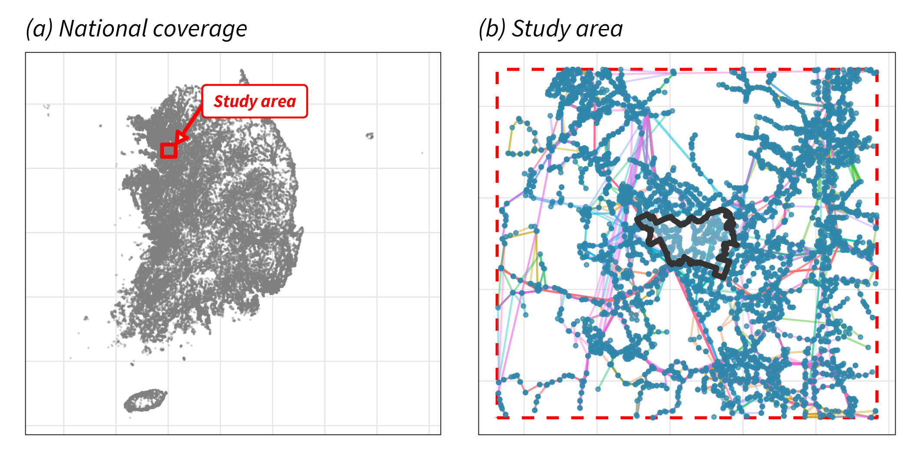
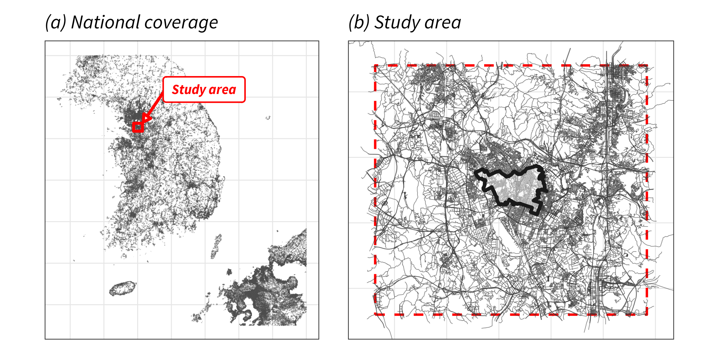

# Data Preparation {#sec-data}

To measure accessibility, we need to know **where trips start**, **where they end**, and **how people travel** between them. This translates into four data components:

1. **Transit schedules** (GTFS): when and where buses and trains run
2. **Street network** (OSM): roads for driving, walking, and cycling
3. **Origins**: where trips start (census units)
4. **Destinations**: where trips end (banks, in this workflow)

```{mermaid}
%%| label: fig-data-components
%%| fig-cap: "Four data components for accessibility routing"
flowchart TD
    A[Accessibility Analysis] --> B[Where from?]
    A --> C[Where to?]
    A --> D[How?]

    B --> E[Origins<br/>Census units]
    C --> F[Destinations<br/>Banks, hospitals, jobs]
    D --> G[Public Transit<br/>GTFS schedules]
    D --> H[Car/Walk/Bike<br/>OSM street network]
```

This chapter covers each component: what it is, where to get it, and how to prepare it for r5r.

## GTFS (Transit Network)

GTFS (General Transit Feed Specification) provides transit schedules for public transport routing: stop locations, routes, departure times, service days. Without it, r5r falls back to car and walking only. A feed is a `.zip` archive of text files; thousands of agencies publish in this [open standard](https://gtfs.org/getting-started/what-is-GTFS/).

::: {.callout-tip collapse="true"}
## GTFS Structure

GTFS uses [interconnected text files](https://gtfs.org/getting-started/features/base/) linked by IDs: `stops.txt` lists station locations, `routes.txt` defines transit lines, `trips.txt` describes individual journeys, `stop_times.txt` specifies arrival/departure times, and `calendar.txt` indicates service days.

You don't need to master every field; r5r handles the parsing. But knowing the structure helps when debugging or validating data. For details, see the [official GTFS documentation](https://gtfs.org/getting-started/features/overview/).
:::

### Preparation Overview

Preparing GTFS for r5r routing involves three steps:

1. **Acquire** from a transit agency or aggregator
2. **Clean** non-standard values that cause parsing failures
3. **Clip** to your study area with appropriate buffer

@fig-gtfs-result shows the outcome: the national feed contains ~210,000 stops; after filtering to the pilot region with 8.5 km buffer, ~5,000 stops remain.

{#fig-gtfs-result}

### Acquire

**Global aggregators** like the [Mobility Database](https://mobilitydatabase.org/) and [Transitland](https://www.transit.land/) collect thousands of feeds from transit agencies worldwide. Coverage varies by region, however, and complete national data may require going directly to transit agencies or government transport databases.

::: {.callout-note collapse="true"}
## Example: South Korea's National GTFS

The Korea Transport Database ([KTDB](https://www.ktdb.go.kr/)) provides national GTFS covering all transit modes (buses, urban rail, intercity, KTX, ferries). KTDB releases annual snapshots based on a typical March weekday. Historical data became available in November 2023; as of December 2025, feeds cover 2021–2024.

To download, go to 정보공개 (Information Disclosure) → 자료신청 (Data Request) → 교통분석데이터 (transport-analysis data). In the selection form, pick 네트워크 → 대중교통 (Network → Public transit) under Step 1, 전국 (nationwide) under Step 2, and the distribution year under Step 3; the public-transit network is what KTDB distributes as GTFS. The site is Korean only, and a browser translator is enough to complete the request form.
:::

### Clean

Raw GTFS feeds often need adjustment before r5r can use them. Start by running the [MobilityData Validator](https://gtfs-validator.mobilitydata.org/); it catches most structural issues like invalid coordinates or malformed sequences.

Some problems are r5r-specific and won't show in validation:

- `agency_timezone` must be IANA format (e.g., `Asia/Seoul`), not legacy identifiers ([r5r#170](https://github.com/ipeaGIT/r5r/issues/170))
- `calendar.txt` dates must cover your analysis period, or r5r silently ignores transit ([r5r#388](https://github.com/ipeaGIT/r5r/issues/388))
- `route_type` must use standard codes 0–7; extended codes cause build failures ([r5r#325](https://github.com/ipeaGIT/r5r/issues/325))

::: {.callout-note collapse="true"}
### Example: Cleaning KTDB Data

When I first loaded KTDB's national GTFS into r5r, the network build completed without errors, but routing returned only car and walking results, with no transit options. After debugging, I found three issues.

#### Timezone format

KTDB uses `Japan` as the timezone identifier, but r5r requires IANA format:

```{r}
#| label: gtfs-clean-timezone
#| eval: false

read_csv("agency.txt") |>
  mutate(agency_timezone = "Asia/Seoul") |>  # "Japan" → IANA format
  write_csv("agency.txt")
```

#### Calendar dates

KTDB provides generic validity dates (2017–2030), but the actual schedules represent a specific reference year. If your routing date falls outside the calendar range, r5r silently ignores all transit. I set the calendar to March of my target year:

```{r}
#| label: gtfs-clean-calendar
#| eval: false

read_csv("calendar.txt") |>
  mutate(
    start_date = 20210301L,  # Set to analysis month (March 2021)
    end_date = 20210331L
  ) |>
  write_csv("calendar.txt")
```

#### Route types

KTDB uses custom route type codes that don't match the [GTFS standard](https://gtfs.org/documentation/schedule/reference/#routestxt). I converted them to standard codes and excluded modes outside my analysis scope:

- Subway (KTDB 1) → standard code 1
- Rail (KTDB 4) → standard code 2
- Bus types (KTDB 0, 2, 3) → standard code 3
- Ferry, cable car (KTDB 5+) → excluded (not used for urban banking access)

```{r}
#| label: gtfs-clean-routes
#| eval: false

routes <- read_csv("routes.txt") |>
  filter(route_type %in% c(0, 1, 2, 3, 4)) |>
  mutate(route_type = case_when(
    route_type %in% c(0, 2, 3) ~ 3L,
    route_type == 1 ~ 1L,
    route_type == 4 ~ 2L
  ))
write_csv(routes, "routes.txt")
```

#### Update related tables

Routes were filtered, so dependent tables need updating too. The cascade flows downward from routes: use `semi_join()` to keep only trips on remaining routes, then stop_times for those trips, then stops that still appear. (This is the reverse of spatial clipping, which starts from stops and flows upward.)

```{r}
#| label: gtfs-clean-cascade
#| eval: false

trips <- read_csv("trips.txt") |>
  semi_join(routes, by = "route_id")  # Keep trips on remaining routes
write_csv(trips, "trips.txt")

stop_times <- read_csv("stop_times.txt") |>
  semi_join(trips, by = "trip_id")    # Keep stop_times for remaining trips
write_csv(stop_times, "stop_times.txt")

stops <- read_csv("stops.txt") |>
  filter(stop_id %in% stop_times$stop_id)  # Keep only used stops
write_csv(stops, "stops.txt")
```

See [scripts/1-preprocess-raw.R](https://github.com/urbanjuhyeon/tracking-access-change/blob/main/scripts/1-preprocess-raw.R) for the complete implementation handling multiple years.
:::

### Clip

r5r loads the entire GTFS network into **Java heap**, so large national feeds can exceed available memory. The solution is to clip to your study area before building the network. For multi-region processing, see @sec-scaling.

Clipping also requires a spatial buffer. Residents near the boundary may access stops or destinations just outside; without a buffer, these cross-boundary trips become invisible to the router.

#### How to clip GTFS

Clipping GTFS requires more than filtering `stops.txt` by coordinates. The tables are linked by IDs, so filtering must cascade: start with stops inside your bounding box (administrative boundary plus buffer), then keep only `stop_times` that reference those stops, only `trips` that appear in those stop_times, and only `routes` that those trips belong to.

```{mermaid}
%%| fig-cap: "GTFS clipping cascade: filter stops spatially, then propagate through related tables"
%%{init: {'theme': 'base', 'themeVariables': { 'primaryColor': '#e8f4f8', 'primaryTextColor': '#1a1a1a', 'primaryBorderColor': '#5c9ead', 'lineColor': '#5c9ead'}}}%%
flowchart LR
    S["stops.txt<br/><small>Filter by bbox</small>"] -->|stop_id| ST["stop_times.txt"]
    ST -->|trip_id| T["trips.txt"]
    T -->|route_id| R["routes.txt"]

    style S fill:#fff5e6,stroke:#f9a825
    style ST fill:#e8f4f8,stroke:#5c9ead
    style T fill:#e8f4f8,stroke:#5c9ead
    style R fill:#e8f4f8,stroke:#5c9ead
```

This keeps the clipped GTFS internally consistent: every ID in one table has a matching record in the others, so r5r can build the network without errors.

::: {.callout-tip collapse="true"}
### How much buffer?

Someone at the study area boundary might travel outward for the entire analysis duration. The buffer must capture everywhere they could realistically reach; otherwise the router truncates valid trips.

This workflow analyzes 30-minute transit accessibility. I estimated the buffer by considering the maximum outward distance:

1. **Walk to stop**: Up to 1.5 km to reach a transit stop outside the boundary
2. **Ride transit**: Urban buses cover roughly 7 km in the remaining time (at 15–20 km/h average)

Total: **8.5 km buffer** captures 30-minute transit trips originating at the boundary.

For longer thresholds or car routing, larger buffers are needed. See @sec-scaling.
:::

::: {.callout-note collapse="true"}
### Example: Clipping to Pilot Region

The national GTFS (~210,000 stops) exceeded available memory for r5r network building. I clipped it to the pilot region (Paldal district, Suwon) with an 8.5 km buffer, reducing to ~5,000 stops.

#### Create buffered bounding box

Start with census tracts, buffer by 8.5 km in a projected CRS, then convert back to WGS84 for coordinate filtering:

```{r}
#| label: gtfs-clip-bbox
#| eval: false

library(sf)
library(tidytransit)

pilot_bbox <- pilot_tracts |>  # sf object of census tracts
  st_transform(5186) |>         # Project to meters (Korea TM)
  st_union() |>
  st_buffer(8500) |>            # 8.5 km buffer
  st_transform(4326) |>         # Back to WGS84
  st_bbox()
```

#### Filter and cascade

Filter stops by bounding box coordinates, then use `semi_join()` to keep only records in related tables that match the filtered stops:

```{r}
#| label: gtfs-clip-filter
#| eval: false

gtfs <- read_gtfs("gtfs_2021.zip")  # National GTFS (cleaned)

# Filter stops spatially
stops_filtered <- gtfs$stops |>
  filter(
    stop_lon >= pilot_bbox["xmin"], stop_lon <= pilot_bbox["xmax"],
    stop_lat >= pilot_bbox["ymin"], stop_lat <= pilot_bbox["ymax"]
  )

# Cascade: keep only records referencing filtered stops
# semi_join(x, y) keeps rows in x that have a match in y
stop_times_filtered <- gtfs$stop_times |>
  semi_join(stops_filtered, by = "stop_id")  # Keep arrivals at filtered stops

trips_filtered <- gtfs$trips |>
  semi_join(stop_times_filtered, by = "trip_id")  # Keep trips serving those stops

routes_filtered <- gtfs$routes |>
  semi_join(trips_filtered, by = "route_id")  # Keep routes with those trips
```

#### Save clipped GTFS

Replace the original tables with filtered versions, then write to a new zip file:

```{r}
#| label: gtfs-clip-save
#| eval: false

gtfs_pilot <- gtfs
gtfs_pilot$stops <- stops_filtered
gtfs_pilot$stop_times <- stop_times_filtered
gtfs_pilot$trips <- trips_filtered
gtfs_pilot$routes <- routes_filtered

write_gtfs(gtfs_pilot, "gtfs_2021_pilot.zip")  # Output path
```

See [scripts/2-pilot-prepare.R](https://github.com/urbanjuhyeon/tracking-access-change/blob/main/scripts/2-pilot-prepare.R) for the full implementation.
:::

## OpenStreetMap (Street Network)

**OSM provides the street network that enables car, walking, and cycling routing.** [OpenStreetMap](https://wiki.openstreetmap.org/wiki/About_OpenStreetMap) is a free, editable map of the world built by volunteers. For routing, it provides roads, paths, and attributes like speed limits and turn restrictions. r5r uses OSM in `.osm.pbf` format.

::: {.callout-tip collapse="true"}
## OSM Structure

OSM data consists of three element types: **nodes** (points), **ways** (lines connecting nodes), and **relations** (groups of elements). For routing, the most important are ways tagged with `highway=*`, which define the road network.

Common highway tags include `motorway`, `primary`, `residential`, `footway`, and `cycleway`. r5r reads these tags to determine which roads are accessible by each mode and at what speed. You don't need to understand every tag (r5r handles the interpretation), but knowing the structure helps when debugging.

For details, see the [OSM wiki on highways](https://wiki.openstreetmap.org/wiki/Key:highway).
:::

### Preparation Overview

Preparing OSM for r5r involves two steps:

1. **Acquire** from Geofabrik or another provider
2. **Clip** to your study area (filtering to highways, since r5r only uses roads for routing)

Unlike GTFS, OSM doesn't require cleaning; the data structure is consistent globally. The main challenge is size: continental extracts can exceed 15 GB, making them impractical to process directly.

@fig-osm-result shows the outcome: the national extract (~400 MB) reduces to ~2 MB for the pilot region.

{#fig-osm-result}

### Acquire

[Geofabrik](https://download.geofabrik.de/) is the standard source for OSM extracts. For current analysis, use country-level files updated daily (e.g., `south-korea-latest.osm.pbf`). For longitudinal analysis, Geofabrik's [raw directory index](https://download.geofabrik.de/) provides annual archives at the continental level (e.g., `asia/asia-210101.osm.pbf`).

OpenStreetMap data is © OpenStreetMap contributors, licensed under the [Open Database License (ODbL) 1.0](https://opendatacommons.org/licenses/odbl/1-0/). Any OSM-derived network you redistribute must keep this attribution and license notice; see `NOTICE.md`.

::: {.callout-note collapse="true"}
## Example: Historical OSM for South Korea

For 2021–2024 banking accessibility analysis, I downloaded annual snapshots from Geofabrik's Asia archive (`asia-210101.osm.pbf` through `asia-240101.osm.pbf`). These continental files were then clipped to South Korea's bounding box for use in routing.
:::

### Clip

Like GTFS, continental or national OSM files are too large to load directly. Clip to your study area first.

OSM clipping typically involves two steps:

1. **Continental → National**: Extract your country from the archive
2. **National → Study area**: Extract your region with buffer

```{mermaid}
%%| fig-cap: "OSM clipping workflow: continental archive to study area"
%%{init: {'theme': 'base', 'themeVariables': { 'primaryColor': '#e8f4f8', 'primaryTextColor': '#1a1a1a', 'primaryBorderColor': '#5c9ead', 'lineColor': '#5c9ead'}}}%%
flowchart LR
    A["Continental<br/><small>e.g., Asia ~15 GB</small>"] -->|bbox clip| B["National<br/><small>e.g., Korea ~400 MB</small>"]
    B -->|highway filter| C["Roads only<br/><small>~150 MB</small>"]
    C -->|bbox clip| D["Study area<br/><small>~1-20 MB</small>"]

    style A fill:#fff5e6,stroke:#f9a825
    style B fill:#f0f7e6,stroke:#7cb342
    style C fill:#f0f7e6,stroke:#7cb342
    style D fill:#e8f4f8,stroke:#5c9ead
```

[Osmium](https://osmcode.org/osmium-tool/) is the standard command-line tool for OSM manipulation. Unlike R packages that load data into memory (often crashing on large files; see [osmdata#261](https://github.com/ropensci/osmdata/issues/261)), Osmium streams data and handles multi-gigabyte files efficiently.

::: {.callout-note collapse="true"}
### Example: Clipping with Osmium on Windows

I used Osmium via WSL (Windows Subsystem for Linux) to clip the Asia continental archive to my pilot region. On other platforms: macOS (`brew install osmium-tool`), Linux (`sudo apt install osmium-tool`), or use [Conda](https://anaconda.org/conda-forge/osmium-tool).

#### Extract and filter

First extract South Korea from the continental archive, then filter to road features only:

```bash
# Clip to South Korea (lon 124-132, lat 32.5-39)
osmium extract -b 124.0,32.5,132.0,39.0 asia-210101.osm.pbf -o korea-2021.osm.pbf

# Filter to highway features only (what r5r uses for routing)
osmium tags-filter korea-2021.osm.pbf w/highway -o korea-2021-roads.osm.pbf
```

The bounding box (`-b`) uses `lon_min,lat_min,lon_max,lat_max` order. The `tags-filter` with `w/highway` keeps only road features, removing buildings and land use.

#### Clip to study area

Clip the national file to the pilot region with 8.5 km buffer:

```bash
# Example: Paldal district + 8.5km buffer
osmium extract -b 126.89,37.21,127.13,37.34 korea-2021-roads.osm.pbf \
  -o pilot_network.osm.pbf --overwrite
```

#### Calling from R

Call osmium from R via `system()` for integration with your workflow:

```{r}
#| label: osm-clip-r
#| eval: false

# Verify osmium is available in WSL
system("wsl osmium --version")

# Create buffered bounding box (same as GTFS clipping)
study_bbox <- pilot_tracts |>
  st_transform(5186) |>
  st_union() |>
  st_buffer(8500) |>
  st_transform(4326) |>
  st_bbox()

# Convert bbox to osmium format: "lon_min,lat_min,lon_max,lat_max"
bbox_str <- paste(round(study_bbox, 5), collapse = ",")

# File paths
national_osm <- "data/osm/korea-2021-roads.osm.pbf"
output_osm <- "data/osm/pilot_network.osm.pbf"

# Build and execute osmium command via WSL
cmd <- glue::glue(
  "wsl osmium extract -b {bbox_str} ",
  "'{national_osm}' -o '{output_osm}' --overwrite"
)
system(cmd, ignore.stdout = TRUE)
```

See [scripts/2-pilot-prepare.R](https://github.com/urbanjuhyeon/tracking-access-change/blob/main/scripts/2-pilot-prepare.R) for the complete implementation.
:::

For multi-region processing, see @sec-scaling.

## Origins

Origins are the **spatial units you measure accessibility from**. Ideally, you'd route from every building, but building-level data is rarely available and routing millions of points is computationally expensive.

Census units are a practical choice. They come with population counts, so you can weight results when aggregating to larger areas. The smallest available level, such as enumeration districts in South Korea (~100,000 units) or census blocks in the US, provides reasonable resolution for urban analysis. The assumption is that everyone in a unit starts from its centroid; this holds well when units are small relative to trip distances.

::: {.callout-note collapse="true"}
## South Korea: Census Units

South Korea's administrative hierarchy is 시도 (province) → 시군구 (municipality, ~250) → 읍면동 (neighborhood, ~3,500). For finer resolution, the statistics agency provides 집계구 (enumeration districts, ~100,000): not administrative units but statistical areas designed for census aggregation.

Boundaries and population: [SGIS](https://sgis.kostat.go.kr/) (free, registration required).
:::

## Destinations

Destinations are **what you're measuring access to**: hospitals, schools, jobs, banks, grocery stores. Your research question determines the destination type; the destination type determines where you get data.

Government registries are often the most reliable source for regulated facilities: healthcare providers, schools, licensed financial institutions. For commercial locations, you may need POI databases or OpenStreetMap (coverage varies). Most destination data comes as addresses, so expect to geocode.

For banking accessibility, we used branch data from the [Korea Federation of Banks](https://www.kfb.or.kr/publicdata/data_other.php). Korean banks are required to report branch locations semi-annually, making this a reliable source for longitudinal analysis. We geocoded the addresses and built a database of branch locations for each half-year period.

With all four inputs assembled, the next chapter (@sec-routing) turns them into travel times.
