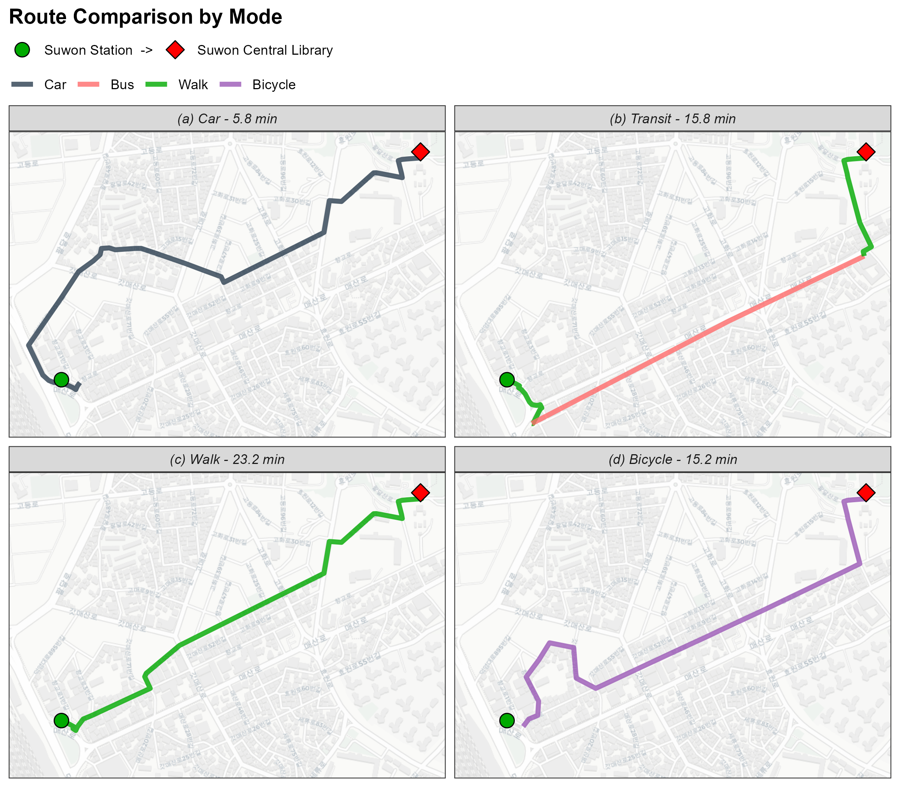
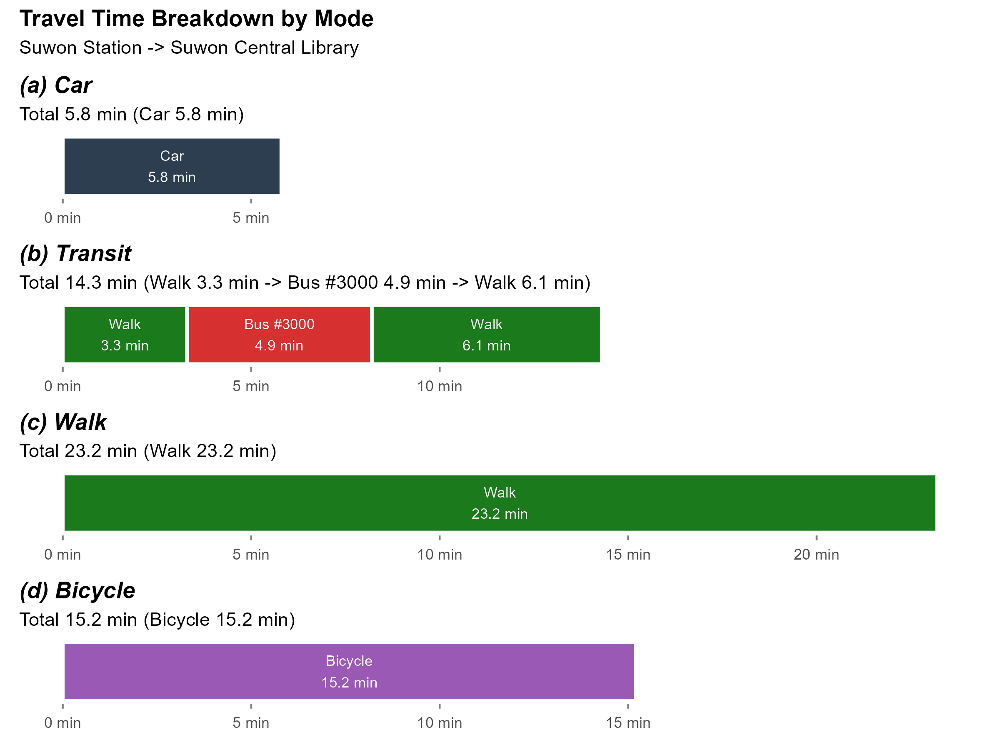
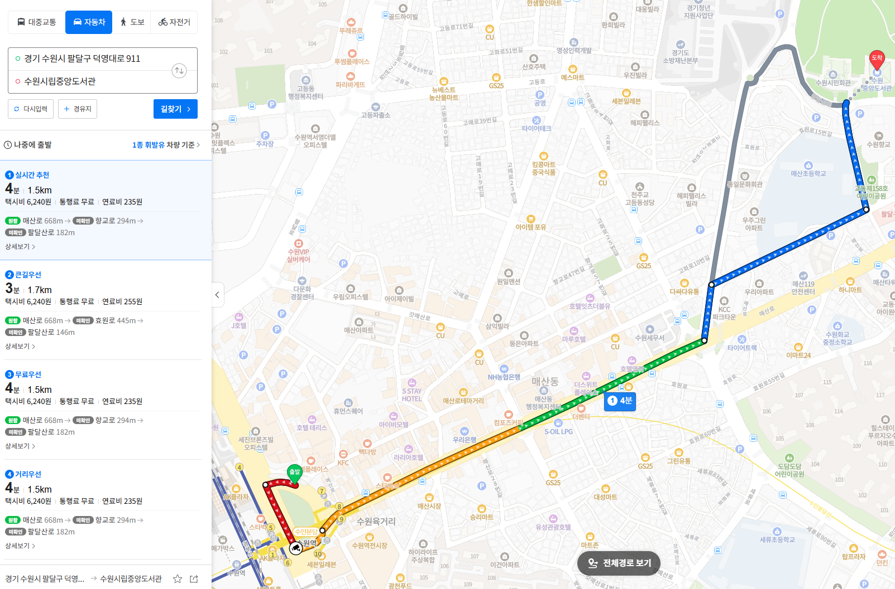
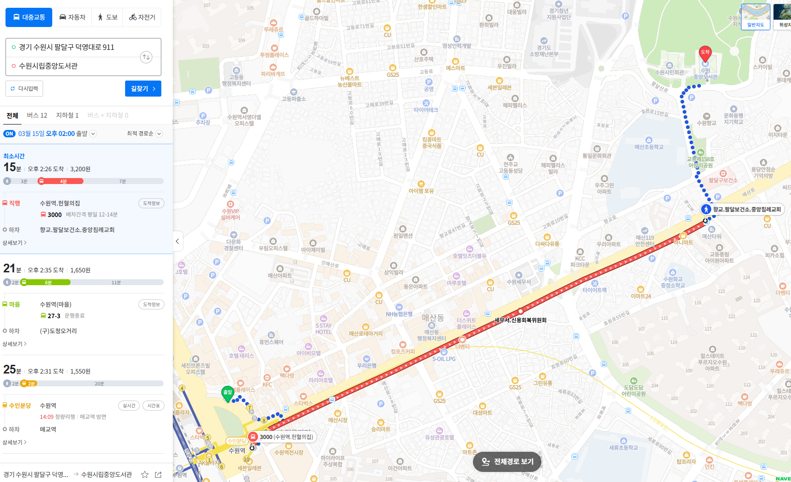
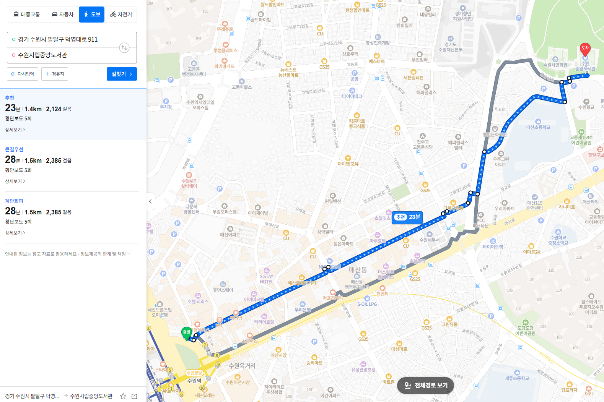
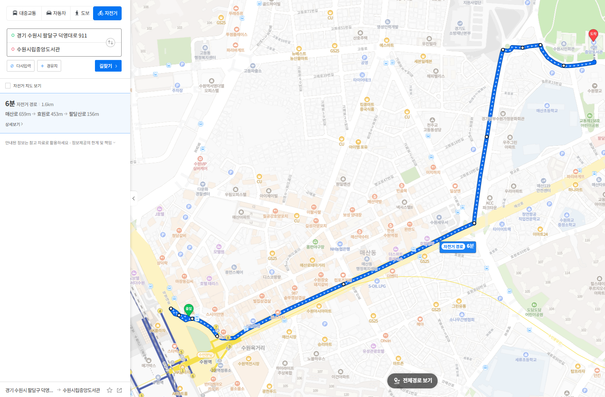
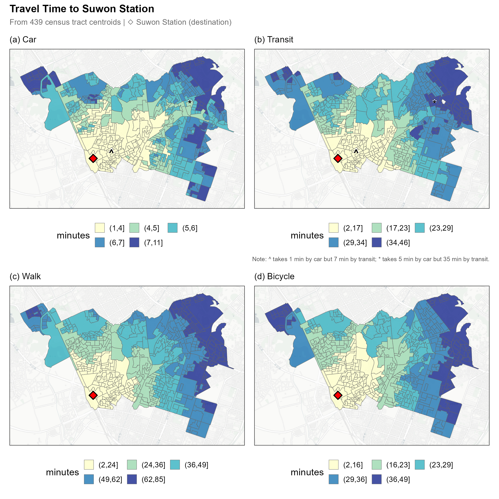
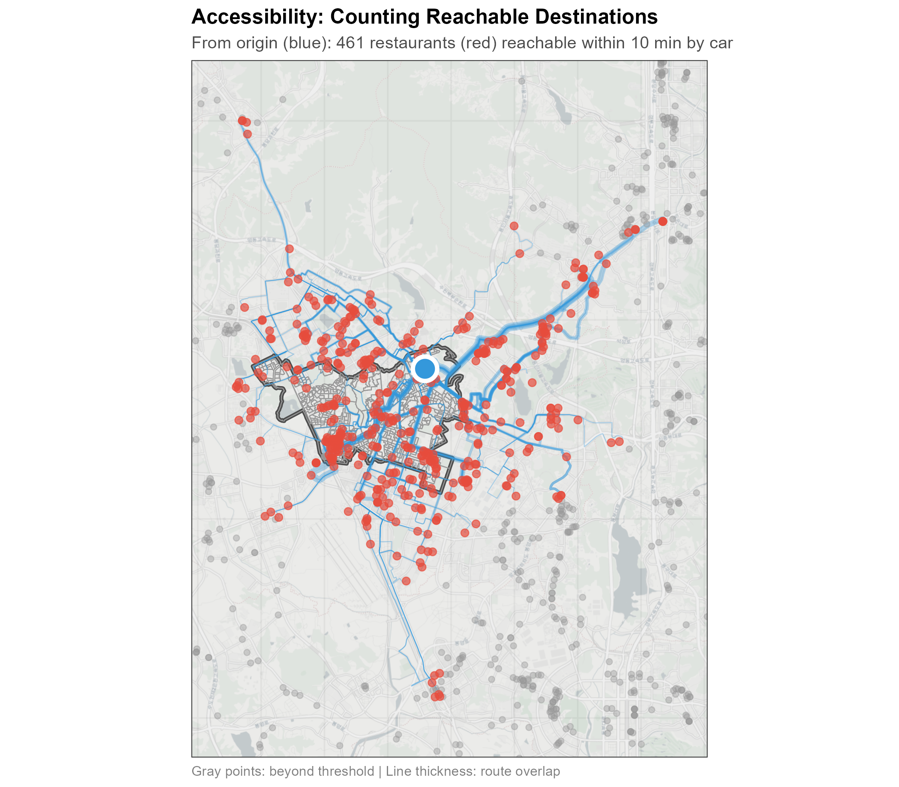
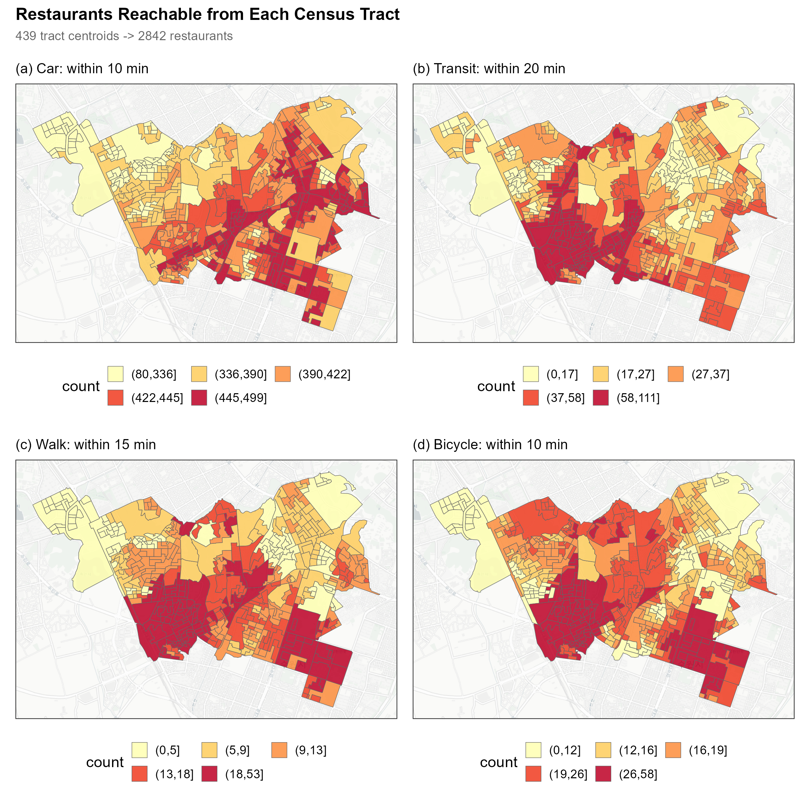

# Routing {#sec-routing}

With the network data prepared in @sec-data, this chapter covers **routing**: calculating travel times between origins and destinations. r5r provides three core functions, each suited to different analytical needs:

- `detailed_itineraries()`: returns full route geometry for validation
- `travel_time_matrix()`: computes OD travel times at scale
- `accessibility()`: calculates cumulative opportunities within time thresholds

We demonstrate each function using a pilot region in South Korea: Paldal district in Suwon, a dense urban area with over 400 census tracts and good transit coverage. This manageable scale allows quick iteration before scaling to larger regions (@sec-scaling).

```{mermaid}
%%| fig-cap: "From prepared data to accessibility metrics via r5r routing"
%%| fig-align: center
%%{init: {'theme': 'base', 'themeVariables': { 'primaryColor': '#e8f4f8', 'primaryTextColor': '#1a1a1a', 'primaryBorderColor': '#5c9ead', 'lineColor': '#5c9ead', 'secondaryColor': '#f0f7e6', 'tertiaryColor': '#fff5e6'}}}%%
flowchart TB
    subgraph Network["Network (Ch.2)"]
        GTFS[GTFS] ~~~ OSM[OSM]
    end

    subgraph Points["OD Points"]
        O[Origins] ~~~ D[Destinations]
    end

    Network -->|"build_network()"| Core[r5r_core]

    subgraph Functions["r5r Routing Functions"]
        F1["detailed_itineraries()"] ~~~ F2["travel_time_matrix()"] ~~~ F3["accessibility()"]
    end

    Core --> Functions
    Points --> Functions

    style Network fill:#d3d3d3,stroke:#999999
    style Points fill:#e8f4f8,stroke:#5c9ead
    style Functions fill:#f0f7e6,stroke:#7cb342
```

## Prerequisites

### Java

r5r requires Java Development Kit (JDK) 21. If you don't have it installed, the easiest approach is through `rJavaEnv`:

```{r}
#| label: java-setup
#| eval: false

# install.packages("rJavaEnv")
rJavaEnv::java_check_version_rjava()
rJavaEnv::java_quick_install(version = 21)
```

### Packages

Before loading r5r, allocate memory to Java. This must happen before the package loads; once the JVM starts, heap size cannot be changed without restarting R.

```{r}
#| label: packages
#| eval: false

options(java.parameters = "-Xmx4G")

pacman::p_load(
  sf, r5r, ggplot2, ggspatial, patchwork,
  dplyr, tidyr, scales, fs
)
```

### Data

This chapter uses a pilot dataset from South Korea. The examples require network files (GTFS and OSM), origin boundaries, and destinations, organized like this:

```
pilot/
├── input/
│   ├── census_tracts.gpkg   # Origin boundaries
│   ├── landmarks.csv        # Known locations for validation
│   └── restaurants.csv      # Destinations
└── network/
    ├── gtfs.zip             # Transit schedules
    └── osm.pbf              # Street network
```

The pilot inputs are derived from licensed sources (KTDB GTFS, SGIS boundaries, geocoded bank branches), so we do not redistribute them; `NOTICE.md` in the repository lists each source and how to obtain it. Every output shown in this chapter was produced from this real dataset.

::: {.callout-tip}
## Reproduce this yourself

The repository ships a license-clean synthetic fixture, [`samples/tutorial-synthetic/`](https://github.com/urbanjuhyeon/tracking-access-change/tree/main/samples/tutorial-synthetic): a fictional 7 × 7 street grid with a four-stop bus route, three origins, and three destinations. Generate it with `python samples/tutorial-synthetic/generate_fixture.py`, then run its `run_example.R` to exercise the same `build_network()` → `travel_time_matrix()` path on open data. To follow this chapter with real inputs, prepare your own study area as described in @sec-data.
:::

::: {.callout-note collapse="true"}
## About the Pilot Data

**Study area**: Paldal-gu, one of four districts in Suwon, covers 12.86 km^2^ with a population of 192,131. The district contains Suwon Station and the historic Hwaseong Fortress.

**census_tracts.gpkg**: 439 census output areas from Statistics Korea's [SGIS](https://sgis.kostat.go.kr/), boundaries as of June 30, 2024. These are comparable to Output Areas in the UK or block groups in the US.

**landmarks.csv**: Four locations (Suwon Station, Central Library, District Office, Health Center) for route validation.

**restaurants.csv**: 2,842 restaurants within 20 km, from Gyeonggi Data Dream (September 2024).

**gtfs.zip / osm.pbf**: Prepared following @sec-data.
:::

Verify the files are in place:

```{r}
#| label: verify-data
#| eval: false

setwd("path/to/your/working/directory")
dir_ls("pilot", recurse = TRUE)
```

```
pilot/input/census_tracts.gpkg
pilot/input/landmarks.csv
pilot/input/restaurants.csv
pilot/network/gtfs.zip
pilot/network/osm.pbf
```

```{r}
#| label: setwd for test
#| include: false
project_root <- Sys.getenv("ACCESS_DECLINE_ROOT", unset = "..")
setwd(file.path(project_root, "workflows"))
```

## Setup

`build_network()` reads GTFS and OSM files from the specified directory and constructs a **routable graph**. The first call compiles this into `network.dat`, which takes 1--5 minutes depending on network complexity. Subsequent calls load from cache.

```{r}
#| label: build-network
#| eval: false

r5r_core <- build_network(data_path = "pilot/network", verbose = FALSE)
```

### Common Parameters

Set departure time and routing constraints that apply to all modes:

```{r}
#| label: params-common
#| eval: false

departure <- as.POSIXct("2024-03-15 14:00:00")
max_walk_time <- 15       # minutes (default: 15)
max_trip_duration <- 120  # minutes (default: 120)
```

The pilot GTFS covers March 2024 weekdays, so we set departure to a Friday afternoon. All routes in this chapter start from this timestamp. `max_walk_time` limits walking to/from transit stops (r5r default: 15 min); `max_trip_duration` caps total travel time; trips exceeding this return `NA` (r5r default: 120 min).

### Mode-Specific Parameters

```{r}
#| label: params-mode
#| eval: false

walk_speed <- 3.6        # km/h (default: 3.6)
bicycle_speed <- 12      # km/h (default: 12)
bicycle_max_lts <- 2     # Level of Traffic Stress 1-4 (default: 2)
```

For **Walk**, the default speed is 3.6 km/h, configurable via `walk_speed` if your study population walks faster or slower. For **Car**, r5r uses free-flow speeds derived from OSM road classifications.

For **Bicycle**, `bike_speed = 12` km/h is a conservative estimate suitable for general population studies. Commercial navigation apps typically use 15--18 km/h, targeting active cyclists.

The `max_lts` (Level of Traffic Stress) parameter controls which roads are accessible: LTS 1 includes only bike lanes and quiet residential streets, LTS 2 (default) adds collector roads with bike infrastructure, LTS 3 includes tertiary and unclassified roads, and LTS 4 allows all roads including arterials. We use the default `max_lts = 2`, which represents routes tolerable for the mainstream adult population, a standard assumption in cycling accessibility research. Researchers studying regions with limited cycling infrastructure may consider `max_lts = 3` to include more road types, though this increases estimated accessibility.

::: {.callout-note collapse="true"}
## Troubleshooting

**Java version error**: r5r requires Java 21+. Install from [Adoptium](https://adoptium.net/).

**Memory error**: Increase heap size (`-Xmx8G`) or reduce study area.

**Transit returns no routes**: The routing date must fall within the GTFS calendar validity period. Check `calendar.txt` in your GTFS.
:::


## detailed_itineraries()

`detailed_itineraries()` returns segment-by-segment route information including geometry, travel time per segment, and transit lines used, making it suited for validation and visualization. We demonstrate with routes between landmarks, then cross-check against a commercial map API.

### OD Pairs

Our pilot dataset includes `landmarks.csv` with known locations:

```{r}
#| label: load-landmarks
#| eval: false

landmarks <- read.csv("pilot/input/landmarks.csv")
landmarks
```

```
  id               name                       lon      lat
1 suwon_station    Suwon Station              127.0008 37.26749
2 central_library  Suwon Central Library      127.0122 37.27325
3 paldal_office    Paldal District Office     127.0201 37.28254
4 paldal_health    Paldal Health Center       127.0124 37.27150
```

We demonstrate with **Suwon Station → Central Library**, a 1.5 km trip through the district center.

```{r}
#| label: od-pairs
#| eval: false

origin_df <- landmarks |>
  filter(id == "suwon_station") |>
  select(id, lon, lat)

dest_df <- landmarks |>
  filter(id == "central_library") |>
  select(id, lon, lat)
```

### Routing

#### Car Route

With `shortest_path = TRUE` (the default), the function returns the fastest route:

```{r}
#| label: calc-car
#| eval: false

car_route <- detailed_itineraries(
  r5r_core, origins = origin_df, destinations = dest_df,
  mode = "CAR", departure_datetime = departure,
  max_trip_duration = max_trip_duration, shortest_path = TRUE
)

car_route |>
  st_drop_geometry() |>
  select(mode, segment, segment_duration, distance)
```

```
  mode segment segment_duration distance
1  CAR       1              5.8     1691
```

The car route returns a single segment: 5.8 minutes to travel 1,691 meters. The `segment_duration` is the travel time in minutes; `distance` is in meters.

#### Transit Route

For transit, specify `mode = c("WALK", "TRANSIT")` to include walking to/from stops:

```{r}
#| label: calc-transit
#| eval: false

transit_route <- detailed_itineraries(
  r5r_core, origins = origin_df, destinations = dest_df,
  mode = c("WALK", "TRANSIT"), departure_datetime = departure,
  max_walk_time = max_walk_time, max_trip_duration = max_trip_duration,
  shortest_path = TRUE
)

transit_route |>
  st_drop_geometry() |>
  select(mode, segment, segment_duration, route, distance)
```

```
  mode segment segment_duration                route distance
1 WALK       1              3.3                          212
2  BUS       2              4.9 BR_TAGO_GGB200000104     1045
3 WALK       3              6.1                          361
```

The transit trip breaks into three segments: walk to stop (3.3 min, 212m), bus ride (4.9 min, 1,045m), and walk to destination (6.1 min, 361m). The segment durations sum to 14.3 minutes, but `total_duration` is 15.8 minutes; the difference (1.5 min) is waiting time at the bus stop. The `route` column contains the GTFS route identifier; join with `routes.txt` to get the public-facing route number.

#### Walk and Bicycle Routes

Walk and bicycle each return a single segment:

```{r}
#| label: calc-walk-bicycle
#| eval: false

walk_route <- detailed_itineraries(
  r5r_core, origins = origin_df, destinations = dest_df,
  mode = "WALK", departure_datetime = departure,
  max_trip_duration = max_trip_duration, shortest_path = TRUE
)

bicycle_route <- detailed_itineraries(
  r5r_core, origins = origin_df, destinations = dest_df,
  mode = "BICYCLE", departure_datetime = departure,
  max_trip_duration = max_trip_duration, shortest_path = TRUE,
  bike_speed = bicycle_speed, max_lts = bicycle_max_lts
)
```

Walk takes 23.2 minutes (1,418m). Bicycle takes 15.2 minutes (1,570m). The bicycle route is longer than walking because LTS=2 restrictions route cyclists around high-traffic areas to use safer roads; this is the expected behavior when prioritizing cyclist safety.

#### Multiple Alternatives

Setting `shortest_path = FALSE` returns multiple route options. The `suboptimal_minutes` parameter controls how many minutes slower than optimal a route can be:

```{r}
#| label: multiple-routes
#| eval: false

multi_routes <- detailed_itineraries(
  r5r_core,
  origins = origin_df, destinations = dest_df,
  mode = c("WALK", "TRANSIT"), departure_datetime = departure,
  max_walk_time = max_walk_time, max_trip_duration = max_trip_duration,
  shortest_path = FALSE,
  suboptimal_minutes = 10
)

multi_routes |>
  st_drop_geometry() |>
  group_by(option) |>
  summarise(total_time = first(total_duration), 
    modes = paste(unique(mode), collapse = "+"))
```

```
  option total_time modes
1      1       15.8 WALK+BUS
2      2       16.6 WALK+BUS
3      3       16.9 WALK+BUS
```

The `option` column distinguishes each alternative. Different options may use the same mode but take different bus lines, useful for understanding travel choices beyond the single fastest path.

### Visualization

The single best routes (`shortest_path = TRUE`) from the previous section can be mapped and broken down into time segments. This helps confirm that routes follow expected paths and that segment durations are reasonable before scaling up to larger analyses.

::: {.callout-note collapse="true"}
## Route Map Code

```{r}
#| label: plot-routes
#| eval: false

routes_sf <- bind_rows(
  car_route |> mutate(mode_type = "car"),
  transit_route |> mutate(mode_type = "transit"),
  walk_route |> mutate(mode_type = "walk"),
  bicycle_route |> mutate(mode_type = "bicycle")
) |>
  group_by(mode_type) |>
  mutate(
    total_time = round(first(total_duration), 1),
    facet_label = case_when(
      mode_type == "car" ~ paste0("(a) Car - ", total_time, " min"),
      mode_type == "transit" ~ paste0("(b) Transit - ", total_time, " min"),
      mode_type == "walk" ~ paste0("(c) Walk - ", total_time, " min"),
      mode_type == "bicycle" ~ paste0("(d) Bicycle - ", total_time, " min")
    )
  ) |>
  ungroup()

od_points <- tibble(
  location = factor(c("Suwon Station  →", "Central Library"),
                    levels = c("Suwon Station  →", "Central Library")),
  lon = c(origin_df$lon, dest_df$lon),
  lat = c(origin_df$lat, dest_df$lat)
) |>
  st_as_sf(coords = c("lon", "lat"), crs = 4326)

ggplot() +
  annotation_map_tile(type = "cartolight", zoomin = -1, progress = "none") +
  geom_sf(data = routes_sf, aes(color = mode), linewidth = 1.5, alpha = 0.8) +
  geom_sf(data = od_points, aes(shape = location, fill = location),
          size = 4, stroke = 0.5, color = "black") +
  scale_color_manual(name = NULL,
                     values = c("CAR" = "#2C3E50", "BUS" = "#FF6B6B",
                                "WALK" = "#00AA00", "BICYCLE" = "#9B59B6"),
                     labels = c("CAR" = "Car", "BUS" = "Bus",
                                "WALK" = "Walk", "BICYCLE" = "Bicycle")) +
  scale_shape_manual(name = NULL, values = c(21, 23)) +
  scale_fill_manual(name = NULL, values = c("#00AA00", "#FF0000")) +
  facet_wrap(~ facet_label, ncol = 2) +
  labs(title = "Route Comparison by Mode", x = NULL, y = NULL) +
  theme_bw() +
  theme(plot.title = element_text(face = "bold"),
        strip.text = element_text(face = "italic"),
        legend.position = "top", legend.box = "vertical",
        axis.text = element_blank(), axis.ticks = element_blank())
```
:::



The four panels show how routing differs by mode:

- **(a) Car** follows the road network directly, taking 5.8 minutes via the shortest drivable path.
- **(b) Transit** combines three segments: walk to bus stop (green), bus ride (red), and walk to destination (green). Total 15.8 minutes, with nearly 60% of time spent walking to/from the bus stop.
- **(c) Walk** takes the most direct pedestrian route (23.2 min), which may cut through alleys and paths unavailable to vehicles.
- **(d) Bicycle** uses a route that avoids high-traffic roads due to LTS=2 restrictions (15.2 min). The path may differ from walking to stay on safer roads.

::: {.callout-note collapse="true"}
## Timeline Code

```{r}
#| label: plot-timeline
#| eval: false

# Prepare data for each mode
timeline_data <- routes_sf |>
  st_drop_geometry() |>
  left_join(gtfs_routes |> select(route_id, route_short_name),
            by = c("route" = "route_id")) |>
  mutate(
    bar_label = case_when(
      mode == "WALK" ~ "Walk",
      mode == "CAR" ~ "Car",
      mode == "BICYCLE" ~ "Bicycle",
      mode == "BUS" & !is.na(route_short_name) ~ paste0("Bus #", route_short_name),
      mode == "SUBWAY" & !is.na(route_short_name) ~ paste0("Subway ", route_short_name),
      TRUE ~ mode
    ),
    start_time = cumsum(lag(segment_duration, default = 0)),
    end_time = start_time + segment_duration
  )

# Create timeline bar chart
ggplot(timeline_data, aes(xmin = start_time, xmax = end_time,
                          ymin = 0, ymax = 1, fill = mode)) +
  geom_rect(color = "white", linewidth = 1) +
  geom_text(aes(x = (start_time + end_time) / 2, y = 0.5,
                label = paste0(bar_label, "\n", round(segment_duration, 1), " min")),
            size = 3, color = "white") +
  scale_fill_manual(values = c("WALK" = "#1B7A1B", "BUS" = "#D63031",
                               "SUBWAY" = "#00B894", "CAR" = "#2C3E50",
                               "BICYCLE" = "#9B59B6")) +
  facet_wrap(~ mode_type, ncol = 1) +
  theme_minimal() +
  theme(axis.text.y = element_blank(), legend.position = "none")
```
:::



The timeline visualizes how each mode spends its travel time. Transit shows three distinct segments; the bar lengths reveal that walking to and from stops (9.4 min combined) takes longer than the actual bus ride (4.9 min). This "last mile" problem is typical for short urban trips. Compare the four bars: bicycle (15.2 min) takes longer than transit in this case, reflecting the LTS=2 restriction that routes cyclists onto safer but longer paths.

::: {.callout-note collapse="true"}
## Cross-check with Map API

To validate r5r results, we compared against a commercial map API (Naver Maps). For car and walking, these services use real-time traffic; for transit, we set the departure to **Friday, March 15, 2024, 2:00 PM**, matching our GTFS validity period.

| Mode | r5r | Map API | Diff |
|------|-----|---------|------|
| Car | 5.8 min | 4 min | +1.8 |
| Transit | 15.8 min | 15 min | +0.8 |
| Walk | 23.2 min | 23 min | +0.2 |
| Bicycle | 15.2 min | 6 min | +9.2 |

Car, transit, and walk results match within 1--2 minutes. The bicycle difference (15.2 vs 6 min) reflects two factors: r5r uses 12 km/h (conservative) while commercial apps use 15--18 km/h, and our LTS=2 restriction routes cyclists onto safer but longer paths. Commercial apps typically optimize for speed on any road.








:::

::: {.callout-note collapse="true"}
## Additional OD Pairs

We tested two more OD pairs. Across all three pairs, r5r and the map API agree within a few minutes, and both recommend Bus #11 for transit in this area.

**Central Library → District Office**

| Mode | r5r | Map API | Diff |
|------|-----|---------|------|
| Car | 5.1 min | 8 min | -2.9 |
| Transit | 21.1 min | 16 min | +5.1 |
| Walk | 26.4 min | 27 min | -0.6 |
| Bicycle | 10.4 min | 6 min | +4.4 |

**District Office → Health Center**

| Mode | r5r | Map API | Diff |
|------|-----|---------|------|
| Car | 5.5 min | 5 min | +0.5 |
| Transit | 16.6 min | 12 min | +4.6 |
| Walk | 27.1 min | 26 min | +1.1 |
| Bicycle | 11.4 min | 6 min | +5.4 |
:::


## travel_time_matrix()

`travel_time_matrix()` computes travel times between **all origin-destination pairs**, returning total travel time without route geometry. It handles many-to-many queries efficiently, making it the core function for large-scale analysis. We calculate travel times from all 439 census tract centroids to Suwon Station.

### Origins and Destination

We use census tract centroids as origins and Suwon Station as the destination:

```{r}
#| label: ttm-setup
#| eval: false

tracts <- st_read("pilot/input/census_tracts.gpkg", quiet = TRUE)

origins <- tracts |>
  st_centroid() |>
  st_transform(4326) |>
  mutate(lon = st_coordinates(geometry)[, 1],
         lat = st_coordinates(geometry)[, 2]) |>
  st_drop_geometry() |>
  select(id = TOT_REG_CD, lon, lat)

landmarks <- read.csv("pilot/input/landmarks.csv")
destination <- landmarks |> filter(id == "suwon_station") |> select(id, lon, lat)
```

### Calculating Travel Times

#### Car and Transit

```{r}
#| label: ttm-car-transit
#| eval: false

ttm_car <- travel_time_matrix(
  r5r_core, origins = origins, destinations = destination,
  mode = "CAR", departure_datetime = departure,
  max_trip_duration = max_trip_duration
)

ttm_transit <- travel_time_matrix(
  r5r_core, origins = origins, destinations = destination,
  mode = c("WALK", "TRANSIT"), departure_datetime = departure,
  max_walk_time = max_walk_time, max_trip_duration = max_trip_duration
)

head(ttm_car, 3)
head(ttm_transit, 3)
```

```
# Car
          from_id         to_id travel_time_p50
1: 31013560030413 suwon_station               6
2: 31013710010101 suwon_station               9
3: 31013550010209 suwon_station               9

# Transit
          from_id         to_id travel_time_p50
1: 31013560030413 suwon_station              20
2: 31013710010101 suwon_station              39
3: 31013550010209 suwon_station              40
```

For Car and Transit, `from_id` contains the census tract IDs (origins) and `to_id` contains the destination. Each row is one origin-destination pair. `travel_time_p50` is the median travel time in minutes; by default, r5r samples departures over a 10-minute window and returns the 50th percentile.

#### Walk and Bicycle

```{r}
#| label: ttm-walk-bicycle
#| eval: false

ttm_walk <- travel_time_matrix(
  r5r_core, origins = origins, destinations = destination,
  mode = "WALK", departure_datetime = departure,
  max_trip_duration = max_trip_duration,
  walk_speed = 3.6
)

ttm_bicycle <- travel_time_matrix(
  r5r_core, origins = origins, destinations = destination,
  mode = "BICYCLE", departure_datetime = departure,
  max_trip_duration = max_trip_duration,
  bike_speed = bicycle_speed, max_lts = bicycle_max_lts
)

head(ttm_walk, 3)
head(ttm_bicycle, 3)
```

```
# Walk
         from_id          to_id travel_time_p50
1: suwon_station 31013560030413              34
2: suwon_station 31013710010101              62
3: suwon_station 31013550010209              64

# Bicycle
         from_id          to_id travel_time_p50
1: suwon_station 31013560030413              15
2: suwon_station 31013710010101              31
3: suwon_station 31013550010209              30
```

**Notice the column swap**: `from_id` contains `suwon_station` (the destination) and `to_id` contains census tract IDs (the origins); the columns are reversed compared to Car and Transit.

This happens because r5r v2.3.0 applies a **reverse search optimization** for Walk and Bicycle when `origins > destinations`. These modes are **bidirectional**: travel time from A→B equals B→A because there are no one-way streets or schedules affecting pedestrians and cyclists. r5r exploits this symmetry by routing from the smaller set (1 destination) to the larger set (439 origins), which is computationally faster. The trade-off is that the output columns are reversed.

Why not Car? Car travel is **not symmetric**: one-way streets, turn restrictions, and varying road speeds mean A→B often differs from B→A. Transit is also asymmetric due to schedules and route directions. So this optimization only applies to Walk and Bicycle.

To fix this, check if `from_id` contains origin IDs and swap columns if needed:

```{r}
#| label: ttm-fix-swap
#| eval: false

origin_ids <- origins$id

# Check and fix Walk
if (!any(ttm_walk$from_id %in% origin_ids)) {
  ttm_walk <- ttm_walk |>
    rename(from_id = to_id, to_id = from_id) |>
    select(from_id, to_id, everything())
}

# Check and fix Bicycle
if (!any(ttm_bicycle$from_id %in% origin_ids)) {
  ttm_bicycle <- ttm_bicycle |>
    rename(from_id = to_id, to_id = from_id) |>
    select(from_id, to_id, everything())
}

head(ttm_walk, 3)
```

```
          from_id         to_id travel_time_p50
1: 31013560030413 suwon_station              34
2: 31013710010101 suwon_station              62
3: 31013550010209 suwon_station              64
```

Now all four modes have consistent column order: `from_id` = origin, `to_id` = destination.

::: {.callout-note collapse="true"}
## r5r Reverse Search Optimization

This behavior is r5r's **reverse search optimization** for direct modes. When there are many origins and few destinations, r5r internally swaps them to use a faster one-to-many algorithm. The travel times are correct, but the column labels are reversed.

This behavior is documented in the [r5r changelog](https://ipeagit.github.io/r5r/news/) under `reverse_if_direct_mode`. A fix is tracked in [GitHub issue #501](https://github.com/ipeaGIT/r5r/issues/501).
:::

### Time Window and Percentiles

Transit travel times depend on departure timing. Leaving 5 minutes earlier might catch an earlier bus; 5 minutes later might mean waiting for the next one. Use `time_window` and `percentiles` to capture this variation:

```{r}
#| label: ttm-variation
#| eval: false

ttm_transit_var <- travel_time_matrix(
  r5r_core, origins = origins, destinations = destination,
  mode = c("WALK", "TRANSIT"), departure_datetime = departure,
  time_window = 60,           # sample departures over 60 minutes
  percentiles = c(25, 50, 75) # return 25th, 50th, 75th percentiles
)

head(ttm_transit_var, 5)
```

```
           from_id         to_id travel_time_p25 travel_time_p50 travel_time_p75
1: 31013560030413 suwon_station              20              21              22
2: 31013710010101 suwon_station              38              40              41
3: 31013550010209 suwon_station              39              41              42
4: 31013550010211 suwon_station              43              55              68
5: 31013550010201 suwon_station              32              34              35
```

Row 4 (`31013550010211`) shows a wide spread: p25=43, p75=68 (25-minute difference). This tract likely has infrequent bus service; timing matters a lot. Row 1 shows only a 2-minute spread (p25=20, p75=22), indicating frequent service where departure timing barely affects travel time.

### Visualization

::: {.callout-note collapse="true"}
## Travel Time Map Code

```{r}
#| label: ttm-viz
#| eval: false

# Join travel times to tract geometry with quantile bins
ttm_car_sf <- tracts |>
  select(TOT_REG_CD, geom) |>
  inner_join(ttm_car, by = c("TOT_REG_CD" = "from_id")) |>
  mutate(time_bin = cut_number(travel_time_p50, n = 5))

ttm_transit_sf <- tracts |>
  select(TOT_REG_CD, geom) |>
  inner_join(ttm_transit, by = c("TOT_REG_CD" = "from_id")) |>
  mutate(time_bin = cut_number(travel_time_p50, n = 5))

ttm_walk_sf <- tracts |>
  select(TOT_REG_CD, geom) |>
  inner_join(ttm_walk, by = c("TOT_REG_CD" = "from_id")) |>
  mutate(time_bin = cut_number(travel_time_p50, n = 5))

ttm_bicycle_sf <- tracts |>
  select(TOT_REG_CD, geom) |>
  inner_join(ttm_bicycle, by = c("TOT_REG_CD" = "from_id")) |>
  mutate(time_bin = cut_number(travel_time_p50, n = 5))

dest_sf <- st_as_sf(destination, coords = c("lon", "lat"), crs = 4326)

# Helper function
create_ttm_map <- function(data, title) {
  ggplot() +
    annotation_map_tile(type = "cartolight", zoomin = 0, progress = "none") +
    geom_sf(data = data, aes(fill = time_bin),
            color = "grey40", linewidth = 0.15, alpha = 0.85) +
    geom_sf(data = dest_sf, shape = 23, fill = "red", size = 3, stroke = 0.8) +
    scale_fill_brewer(name = "minutes", palette = "YlGnBu", direction = 1,
                      na.value = "grey80") +
    guides(fill = guide_legend(nrow = 2)) +
    labs(title = title, x = NULL, y = NULL) +
    theme_bw() +
    theme(axis.text = element_blank(), axis.ticks = element_blank(),
          legend.position = "bottom", legend.key.size = unit(0.4, "cm"),
          plot.title = element_text(size = 10))
}

# Combine 4 maps
ttm_map <- (create_ttm_map(ttm_car_sf, "(a) Car") +
            create_ttm_map(ttm_transit_sf, "(b) Transit")) /
           (create_ttm_map(ttm_walk_sf, "(c) Walk") +
            create_ttm_map(ttm_bicycle_sf, "(d) Bicycle")) +
  plot_annotation(
    title = "Travel Time to Suwon Station",
    subtitle = paste0("From ", nrow(origins), " census tract centroids"),
    theme = theme(plot.title = element_text(face = "bold", size = 12),
                  plot.subtitle = element_text(size = 9, color = "grey40"))
  )

ggsave("travel_time_matrix.png", ttm_map, width = 8, height = 8, dpi = 300, bg = "white")
```
:::



The maps use `cut_number()` to create quantile-based bins with equal counts per category. Transit, walk, and bicycle show concentric patterns radiating from Suwon Station: travel time increases with distance from the destination. Car shows a different pattern: the fastest times appear along major arterial roads (near City Hall and commercial districts) rather than simply near the station. This reflects how r5r calculates car travel times using free-flow speeds derived from OSM road classifications. Areas with good access to primary and secondary roads can reach the station faster than nearby areas served only by narrow local streets or one-way networks.

The `*` and `^` markers highlight tracts with the largest modal gap, where car has the biggest advantage over transit. These peripheral locations have infrequent or circuitous bus service; as the map note shows, their transit trips take about seven times longer than driving.


## accessibility()

`accessibility()` calculates how many **opportunities are reachable** from each origin within a travel time threshold. Unlike `travel_time_matrix()`, which returns times for each OD pair, this function aggregates per origin, returning one accessibility score rather than a full matrix. We measure restaurant accessibility for each census tract.

### Destinations

```{r}
#| label: accessibility-dest
#| eval: false

restaurants <- read.csv("pilot/input/restaurants.csv")
destinations <- restaurants |> mutate(opportunities = 1)
```

Each restaurant counts as one opportunity. The `opportunities` column can be weighted (e.g., by number of employees) for job accessibility.



The figure illustrates the concept: from a single census tract (blue), we count how many restaurants (red points) are reachable within a given travel time. The gray points show restaurants outside the 10-minute car travel radius. This count becomes the tract's accessibility score, repeated for all 439 tracts to produce the accessibility map.

### Calculating Accessibility

```{r}
#| label: accessibility
#| eval: false

# Different cutoffs reflect realistic travel expectations per mode
car_cutoff <- 10       # Car: 10-min radius
transit_cutoff <- 20   # Transit: 20-min radius (includes walk + wait + ride)
walk_cutoff <- 15      # Walk: 15-min radius
bicycle_cutoff <- 10   # Bicycle: 10-min radius

access_car <- accessibility(
  r5r_core, origins = origins, destinations = destinations,
  mode = "CAR", departure_datetime = departure,
  cutoffs = car_cutoff, decay_function = "step",
  max_trip_duration = 30
)

access_transit <- accessibility(
  r5r_core, origins = origins, destinations = destinations,
  mode = c("WALK", "TRANSIT"), departure_datetime = departure,
  cutoffs = transit_cutoff, decay_function = "step",
  max_walk_time = max_walk_time, max_trip_duration = 30
)

access_walk <- accessibility(
  r5r_core, origins = origins, destinations = destinations,
  mode = "WALK", departure_datetime = departure,
  cutoffs = walk_cutoff, decay_function = "step",
  max_trip_duration = 30, walk_speed = 3.6
)

access_bicycle <- accessibility(
  r5r_core, origins = origins, destinations = destinations,
  mode = "BICYCLE", departure_datetime = departure,
  cutoffs = bicycle_cutoff, decay_function = "step",
  max_trip_duration = 30, bike_speed = bicycle_speed, max_lts = bicycle_max_lts
)

head(access_car, 5)
head(access_transit, 5)
```

```
                 id   opportunity percentile cutoff accessibility
1: 31013560030413 opportunities         50     10           349
2: 31013710010101 opportunities         50     10           242
3: 31013550010209 opportunities         50     10           237
4: 31013550010211 opportunities         50     10           144
5: 31013550010201 opportunities         50     10           408

                 id   opportunity percentile cutoff accessibility
1: 31013560030413 opportunities         50     20            30
2: 31013710010101 opportunities         50     20             7
3: 31013550010209 opportunities         50     20             2
4: 31013550010211 opportunities         50     20             0
5: 31013550010201 opportunities         50     20            13
```

Row 4 (`31013550010211`) shows 144 restaurants by car but 0 by transit, the same tract with high schedule variability in the TTM section. The `decay_function = "step"` counts all opportunities within the cutoff equally; `exponential` and `logistic` weight closer destinations more heavily.

### Visualization

::: {.callout-note collapse="true"}
## Accessibility Map Code

```{r}
#| label: accessibility-viz
#| eval: false

# Join accessibility to tract geometry with quantile bins
access_car_sf <- tracts |>
  select(TOT_REG_CD, geom) |>
  inner_join(access_car |> select(id, accessibility), by = c("TOT_REG_CD" = "id")) |>
  mutate(access_bin = cut_number(accessibility, n = 5))

access_transit_sf <- tracts |>
  select(TOT_REG_CD, geom) |>
  inner_join(access_transit |> select(id, accessibility), by = c("TOT_REG_CD" = "id")) |>
  mutate(access_bin = cut_number(accessibility, n = 5))

access_walk_sf <- tracts |>
  select(TOT_REG_CD, geom) |>
  inner_join(access_walk |> select(id, accessibility), by = c("TOT_REG_CD" = "id")) |>
  mutate(access_bin = cut_number(accessibility, n = 5))

access_bicycle_sf <- tracts |>
  select(TOT_REG_CD, geom) |>
  inner_join(access_bicycle |> select(id, accessibility), by = c("TOT_REG_CD" = "id")) |>
  mutate(access_bin = cut_number(accessibility, n = 5))

# Helper function
create_access_map <- function(data, title) {
  ggplot() +
    annotation_map_tile(type = "cartolight", zoomin = 0, progress = "none") +
    geom_sf(data = data, aes(fill = access_bin),
            color = "grey40", linewidth = 0.15, alpha = 0.85) +
    scale_fill_brewer(name = "count", palette = "YlOrRd", direction = 1,
                      na.value = "grey80") +
    guides(fill = guide_legend(nrow = 2)) +
    labs(title = title, x = NULL, y = NULL) +
    theme_bw() +
    theme(axis.text = element_blank(), axis.ticks = element_blank(),
          legend.position = "bottom", legend.key.size = unit(0.4, "cm"),
          plot.title = element_text(size = 10))
}

# Combine 4 maps
access_map <- (create_access_map(access_car_sf, "(a) Car: within 10 min") +
               create_access_map(access_transit_sf, "(b) Transit: within 20 min")) /
              (create_access_map(access_walk_sf, "(c) Walk: within 15 min") +
               create_access_map(access_bicycle_sf, "(d) Bicycle: within 10 min")) +
  plot_annotation(
    title = "Restaurants Reachable from Each Census Tract",
    subtitle = paste0(nrow(origins), " tract centroids → ", nrow(restaurants), " restaurants"),
    theme = theme(plot.title = element_text(face = "bold", size = 12),
                  plot.subtitle = element_text(size = 9, color = "grey40"))
  )

ggsave("accessibility_map.png", access_map, width = 8, height = 8, dpi = 300, bg = "white")
```
:::



Car accessibility (10-min cutoff) follows restaurant density: high values appear along commercial corridors where destinations cluster. Transit accessibility (20-min cutoff) shows a different pattern: high values concentrate near transit hubs regardless of where restaurants are located, while peripheral areas with infrequent bus service show near-zero accessibility. Walk and bicycle accessibility strongly reflect local restaurant density, with bicycle covering a larger catchment area. In short: car and bicycle accessibility reflect where destinations are; transit accessibility reflects where the network goes.


## Cleanup {.unnumbered}

When finished, release r5r resources:

```{r}
#| label: cleanup
#| eval: false

stop_r5(r5r_core)
```

The next chapter (@sec-scaling) demonstrates scaling this workflow to larger regions and multiple time periods.
