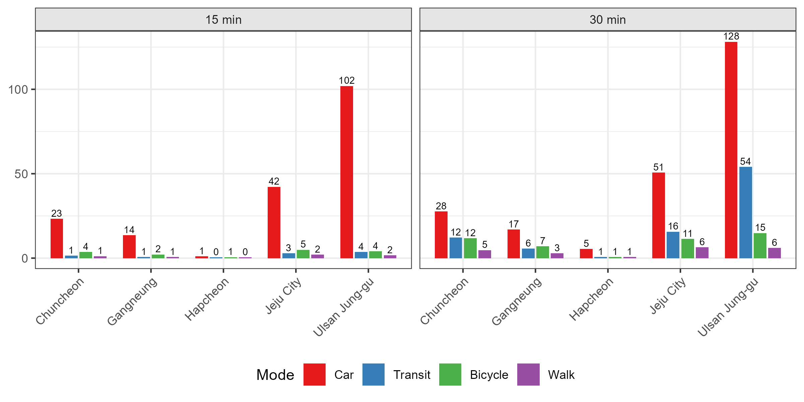

# Scaling {#sec-scaling}

Scaling extends routing from a single district to **national coverage**. A country-wide network exceeds typical RAM because millions of stops and road segments cannot be processed at once. We therefore partition national data into district-level packages, route each independently, and merge the results through the **split-apply-combine** pattern.

```{mermaid}
%%| fig-cap: "Split-apply-combine: partition data, route in parallel, merge results"
%%| fig-align: center
%%{init: {'theme': 'base', 'themeVariables': { 'primaryColor': '#e8f4f8', 'primaryTextColor': '#1a1a1a', 'primaryBorderColor': '#5c9ead', 'lineColor': '#5c9ead', 'secondaryColor': '#f0f7e6', 'tertiaryColor': '#fff5e6'}}}%%
flowchart LR
    A[National<br/>GTFS + OSM] -->|split| parallel

    subgraph parallel[x N districts]
        direction TB
        B[District<br/>Network] -->|apply| C[Travel Time<br/>Matrix]
    end

    parallel -->|combine| D[National<br/>Accessibility]

    style A fill:#e8f4f8,stroke:#5c9ead
    style B fill:#f0f7e6,stroke:#7cb342
    style C fill:#f0f7e6,stroke:#7cb342
    style D fill:#fff5e6,stroke:#f9a825
    style parallel fill:none,stroke:#7cb342,stroke-dasharray: 5 5
```

This chapter first explains spatial partitioning: how to divide national data into district packages. Then, using a 5-district sample dataset, it walks through parallel processing, fault tolerance, and result aggregation.


## Split: Partitioning by District {#sec-partitioning}

::: {.callout-important}
This section is conceptual: partitioning requires full national GTFS/OSM prepared in @sec-data (~200 MB + ~150 MB per year). We do not distribute these files due to licensing restrictions on the original transit and map data. For the worked example on pre-partitioned sample data, skip to @sec-sample-data.
:::

### Why Partition?

r5r loads the entire network into **Java heap memory**. A national network, with millions of transit stops and road segments, exceeds typical RAM limits. Partitioning the data produces smaller units that each fit in memory.

We partition by **administrative district**: Si/Gun/Gu in Korea (252 units), counties in the US (~3,000), or local authorities in the UK (~300). This choice balances three concerns:

- **Memory**: Each district network fits in 6–8 GB heap
- **Parallelism**: Hundreds of units distribute evenly across workers
- **Policy relevance**: Results align with administrative boundaries for reporting

Each district becomes a self-contained package that can be routed independently, with no cross-district dependencies.

### What Goes in a Package?

Each package contains four components, the same data types from @sec-data but scoped to one district:

```{mermaid}
%%| fig-cap: "National data → district packages"
%%| fig-align: center
%%{init: {'theme': 'base', 'themeVariables': { 'primaryColor': '#e8f4f8', 'primaryTextColor': '#1a1a1a', 'primaryBorderColor': '#5c9ead', 'lineColor': '#5c9ead', 'secondaryColor': '#f0f7e6', 'tertiaryColor': '#fff5e6'}}}%%
flowchart TB
    subgraph national["National Data"]
        A[GTFS]
        B[OSM]
        C[Census]
        D[Banks]
    end

    A -->|"clip + buffer"| E[District GTFS]
    B -->|"clip + buffer"| F[District OSM]
    C -->|"filter"| G[District Origins]
    D -->|"filter + buffer"| H[District Destinations]

    subgraph district["Per-District Package"]
        E
        F
        G
        H
    end

    style national fill:#e8f4f8,stroke:#5c9ead
    style district fill:#f0f7e6,stroke:#7cb342
```

- **Origins**: Census tract centroids within the district boundary
- **Destinations**: Bank locations within district + 25 km buffer
- **Network**: GTFS and OSM clipped to district + 25 km buffer

The asymmetry is intentional. Origins stay **strictly within the district** so each census tract is routed exactly once, with no duplicates across districts. Everything else (destinations, GTFS, OSM) extends into a **25 km buffer zone** to capture cross-boundary trips.

### Buffer Distance

The buffer must capture everywhere a resident could realistically travel. Consider Manhattan: origins are census tract centroids within the borough, but residents routinely reach destinations in Brooklyn, Queens, or New Jersey.

```{mermaid}
%%| fig-cap: "Origins within district; network and destinations extend into buffer zone"
%%| fig-align: center
%%{init: {'theme': 'base', 'themeVariables': { 'primaryColor': '#fff', 'primaryTextColor': '#1a1a1a', 'primaryBorderColor': '#333'}, 'flowchart': {'padding': 10, 'nodeSpacing': 40, 'rankSpacing': 1}}}%%
flowchart LR
    subgraph buffer["25 km Buffer Zone"]
        subgraph extended[" "]
            direction TB
            N["Network: GTFS + OSM"] ~~~ D["Destinations: Banks"]
        end
        subgraph core["District Boundary"]
            O["Origins<br/>(census centroids)"]
        end
    end

    style buffer fill:#f5f5f5,stroke:#999,stroke-width:2px,stroke-dasharray: 5 5
    style core fill:#e3f2fd,stroke:#1976d2,stroke-width:2px
    style extended fill:none,stroke:none
    style O fill:#bbdefb,stroke:#1976d2
    style N fill:#c8e6c9,stroke:#388e3c
    style D fill:#ffecb3,stroke:#f57c00
```

The buffer distance follows from the routing caps. This analysis routes trips of up to 60 minutes by transit and 45 minutes by car (accessibility thresholds applied later can be anything below these caps). At typical speeds:

- **Transit**: 20–30 km/h average (including stops and transfers) → 20–30 km in 60 min
- **Car**: 30–40 km/h in urban traffic → 22–30 km in 45 min

A **25 km buffer** captures nearly all reachable destinations. This is larger than the 8.5 km buffer in @sec-data because we're now analyzing longer trips (60 min vs 30 min).

### Clipping Implementation

The clipping techniques are the same as in @sec-data (GTFS cascade filtering and OSM bounding box extraction), but applied 252 times instead of once.

::: {.callout-note collapse="true"}
## Full partitioning code

This code creates district packages for multiple years. For the full national run, it processes 252 districts × 4 years = 1,008 packages. The sample data in @sec-sample-data uses 5 districts × 1 year.

**Input** (from @sec-data):

```
data/
├── census/
│   ├── sgg_bnd.gpkg          # District boundaries
│   └── oa_bnd.gpkg           # Census tracts (origins)
├── bank/banks.csv            # Bank locations (destinations)
├── gtfs/
│   ├── gtfs_2021.zip
│   ├── gtfs_2022.zip
│   ├── gtfs_2023.zip
│   └── gtfs_2024.zip
└── osm/
    ├── korea_2021.osm.pbf
    ├── korea_2022.osm.pbf
    ├── korea_2023.osm.pbf
    └── korea_2024.osm.pbf
```

**Output**:

```
partitioned/
├── origins/census.gpkg       # Shared across years
├── destinations/banks.csv    # Shared across years
└── 2023/                     # Year-specific networks
    └── districts/
        ├── 26010/
        │   ├── network.zip
        │   └── network.osm.pbf
        └── .../
```

```{r}
#| label: partition-full
#| eval: false

library(tidyverse)
library(sf)
library(tidytransit)
library(fs)
library(glue)


# Configuration ---------------------------------------------------------------

PROJECT_ROOT <- "path/to/your/project"
OUTPUT_DIR <- path(PROJECT_ROOT, "partitioned")

BUFFER_KM <- 25
TARGET_CRS <- 5186
WGS84 <- 4326

# Years to process
TARGET_YEARS <- 2021:2024

# Districts: 5 for sample, all 252 for full run
TARGET_DISTRICTS <- c(

  "26010",
  "32010",

  "32030",
  "38600",
  "39010"
)
# For full run:
# TARGET_DISTRICTS <- unique(sgg_sf$SIGUNGU_CD)


# Load static data (shared across years) --------------------------------------

sgg_sf <- st_read(
  path(PROJECT_ROOT, "data/census/sgg_bnd.gpkg"),
  quiet = TRUE
) |>
  st_transform(WGS84)

census_sf <- st_read(
  path(PROJECT_ROOT, "data/census/oa_bnd.gpkg"),
  quiet = TRUE
) |>
  st_transform(WGS84)

banks_df <- read_csv(
  path(PROJECT_ROOT, "data/bank/banks.csv"),
  show_col_types = FALSE
)


# Part 1: Origins and destinations (year-independent) -------------------------

dir_create(path(OUTPUT_DIR, "origins"))
dir_create(path(OUTPUT_DIR, "destinations"))

# Origins: census tracts within target districts
origins_sf <- census_sf |>
  filter(SIGUNGU_CD %in% TARGET_DISTRICTS)

st_write(
  origins_sf,
  path(OUTPUT_DIR, "origins/census.gpkg"),
  delete_dsn = TRUE
)
message(glue("Origins: {nrow(origins_sf)} census tracts"))

# Destinations: banks within buffered boundary
target_boundary <- sgg_sf |>
  filter(SIGUNGU_CD %in% TARGET_DISTRICTS) |>
  st_union() |>
  st_transform(TARGET_CRS) |>
  st_buffer(BUFFER_KM * 1000) |>
  st_transform(WGS84)

banks_sf <- banks_df |>
  filter(!is.na(lon), !is.na(lat)) |>
  st_as_sf(coords = c("lon", "lat"), crs = WGS84) |>
  st_filter(target_boundary)

destinations_df <- banks_sf |>
  mutate(
    lon = st_coordinates(geometry)[, 1],
    lat = st_coordinates(geometry)[, 2]
  ) |>
  st_drop_geometry()

write_csv(
  destinations_df,
  path(OUTPUT_DIR, "destinations/banks.csv")
)
message(glue("Destinations: {nrow(destinations_df)} banks"))


# Part 2: Per-year, per-district networks -------------------------------------

for (year in TARGET_YEARS) {

  message(glue("\n\n=== Processing year {year} ==="))

  # Load year-specific GTFS

  gtfs_path <- path(
    PROJECT_ROOT, "data/gtfs",
    glue("gtfs_{year}.zip")
  )
  gtfs <- read_gtfs(gtfs_path)

  stops_sf <- gtfs$stops |>
    filter(!is.na(stop_lon), !is.na(stop_lat)) |>
    st_as_sf(coords = c("stop_lon", "stop_lat"), crs = WGS84)

  # Year-specific OSM
  osm_source <- path(
    PROJECT_ROOT, "data/osm",
    glue("korea_{year}.osm.pbf")
  )

  # Create year directory
  year_dir <- path(OUTPUT_DIR, year, "districts")
  dir_create(year_dir)


  for (district_code in TARGET_DISTRICTS) {

    message(glue("\n  {district_code}..."))

    dist_dir <- path(year_dir, district_code)
    dir_create(dist_dir)

    # District boundary + buffer
    sgg_poly <- sgg_sf |>
      filter(SIGUNGU_CD == district_code)

    bbox_poly <- sgg_poly |>
      st_transform(TARGET_CRS) |>
      st_buffer(BUFFER_KM * 1000) |>
      st_transform(WGS84)

    bbox <- st_bbox(bbox_poly)


    # Clip GTFS (cascade: stops → stop_times → trips → routes)
    stops_in_region <- stops_sf |>
      st_filter(bbox_poly)
    stop_ids <- stops_in_region$stop_id

    gtfs_clipped <- list()

    gtfs_clipped$stops <- gtfs$stops |>
      filter(stop_id %in% stop_ids)

    gtfs_clipped$stop_times <- gtfs$stop_times |>
      filter(stop_id %in% stop_ids)

    trip_ids <- unique(gtfs_clipped$stop_times$trip_id)
    gtfs_clipped$trips <- gtfs$trips |>
      filter(trip_id %in% trip_ids)

    route_ids <- unique(gtfs_clipped$trips$route_id)
    gtfs_clipped$routes <- gtfs$routes |>
      filter(route_id %in% route_ids)

    gtfs_clipped$agency <- gtfs$agency
    gtfs_clipped$calendar <- gtfs$calendar

    class(gtfs_clipped) <- class(gtfs)
    write_gtfs(gtfs_clipped, path(dist_dir, "network.zip"))


    # Clip OSM
    bbox_str <- paste(bbox, collapse = ",")
    osm_out <- path(dist_dir, "network.osm.pbf")

    cmd <- glue(
      "osmium extract -b {bbox_str} ",
      "'{osm_source}' -o '{osm_out}' --overwrite"
    )
    system(cmd, ignore.stdout = TRUE)

    osm_mb <- round(file_size(osm_out) / 1024^2, 1)
    message(glue("    {length(stop_ids)} stops, {osm_mb} MB OSM"))
  }

  # Clean up year's GTFS from memory
  rm(gtfs, stops_sf)
  gc()
}

message(glue("\n\nDone! {length(TARGET_YEARS)} years × ",
             "{length(TARGET_DISTRICTS)} districts"))
```
:::


## Sample Data {#sec-sample-data}

The partitioning code in @sec-partitioning produces district packages. The rest of this chapter uses a pre-built sample with 2023 network data for five districts. These districts range from dense metropolitan centers to rural counties. Like the national inputs, the sample embeds licensed data: KTDB GTFS, SGIS boundaries, and geocoded bank branches. We therefore do not redistribute it. Every output below comes from this real dataset and is shown for illustration. For a runnable, license-clean starting point, generate the synthetic fixture in [`samples/tutorial-synthetic/`](https://github.com/urbanjuhyeon/tracking-access-change/tree/main/samples/tutorial-synthetic). Then apply the code in this section to district packages prepared for your own study area.

### Setup

The workflow expects the district packages in a `scaling_sample/` folder alongside your R script:

```
your_project/
├── scaling_sample/
│   ├── origins/
│   ├── destinations/
│   └── districts/
└── your_script.R
```

With the data in place, load the required packages and point to the sample directory. We use `{tidyverse}` for data manipulation, `{sf}` for spatial operations, `{fs}` for file handling, and `{r5r}` for routing:

```{r}
#| label: setup-sample
#| eval: false

library(tidyverse)
library(sf)
library(fs)
library(r5r)

DATA_DIR <- "scaling_sample"
```

Before proceeding, confirm the expected structure exists by inspecting the directory tree:

```{r}
#| label: check-structure
#| eval: false

dir_tree(DATA_DIR, recurse = 2)
```

```
scaling_sample
├── origins/
│   └── census.gpkg          # 2,665 census tracts
├── destinations/
│   └── banks.csv            # 392 bank branches
└── districts/
    ├── 26010/
    │   ├── network.zip      # GTFS (clipped)
    │   └── network.osm.pbf  # OSM (clipped)
    ├── 32010/
    │   └── ...
    └── ...
```

Origins and destinations are **shared files**; each routing job filters them to the relevant district at runtime. Network files are already **district-specific**, with the same structure produced by @sec-partitioning.

::: {.callout-note collapse="true"}
## About the sample districts

We selected five districts to represent the range of contexts in a national analysis:

| Code | District | Context | Area | Origins | Destinations |
|------|----------|---------|-----:|--------:|-------------:|
| 26010 | Ulsan Jung-gu | Dense metropolitan core | 37 km² | 422 | 21 |
| 32010 | Chuncheon | Provincial capital | 1,116 km² | 599 | 25 |
| 32030 | Gangneung | Coastal mid-size city | 1,042 km² | 453 | 17 |
| 38600 | Hapcheon | Rural, low-density county | 984 km² | 84 | 3 |
| 39010 | Jeju | Island, isolated network | 984 km² | 1,107 | 55 |

**Reading the table:**

- **Area**: District boundary only (buffer not included)
- **Origins**: Census tracts within district: these become routing origins
- **Destinations**: Banks inside the district boundary. Routing itself considers every bank within the 25 km buffer (132 candidates for Ulsan Jung-gu), so cross-boundary access is captured.

**Why these five?** They span district size (37–1,116 km²), population concentration (84–1,107 census tracts), bank availability (3–55 branches), and network topology (mainland connected vs. island isolated). Routing performance and accessibility patterns differ substantially across these contexts.

**Data vintage**: 2023 GTFS/OSM networks. District codes follow the Korean administrative code system (comparable to US FIPS or UK GSS codes).
:::

::: {.callout-note collapse="true"}
## Data structure details

**Origins** (`origins/census.gpkg`): 2,665 census tract polygons

```{r}
#| label: load-origins
#| eval: false

origins_sf <- st_read(path(DATA_DIR, "origins/census.gpkg"), quiet = TRUE)
head(origins_sf, 5)
```

```
Simple feature collection with 5 features and 4 fields
Geometry type: MULTIPOLYGON
Projected CRS: KGD2002 / Unified CS
              id district_cd sido_cd population                           geom
1 26010681020008       26010      26          0 MULTIPOLYGON (((1165950 173...
2 32010380020001       32010      32        492 MULTIPOLYGON (((1021766 200...
3 32010390010001       32010      32        508 MULTIPOLYGON (((1042483 200...
4 32010670030702       32010      32        611 MULTIPOLYGON (((1020253 198...
5 32030110050002       32030      32        401 MULTIPOLYGON (((1112840 199...
```

- `id`: Census tract ID (national standard)
- `district_cd`: District code linking to our five sample districts
- `population`: Resident count for weighted aggregation
- `geom`: Polygon boundary (r5r uses centroids for routing)

**Destinations** (`destinations/banks.csv`): 392 bank branches

```{r}
#| label: load-destinations
#| eval: false

destinations_df <- read_csv(path(DATA_DIR, "destinations/banks.csv"))
head(destinations_df, 5)
```

```
  id           bank_name branch_name      lon      lat
1  1 BNK Gyeongnam Bank    Geochang 127.9065 35.68861
2  2 BNK Gyeongnam Bank     Guyeong 129.2424 35.57147
3  3 BNK Gyeongnam Bank  Gulhwa Ctr 129.2649 35.55462
4  4 BNK Gyeongnam Bank      Nammok 129.4238 35.53925
5  5 BNK Gyeongnam Bank    Namjinju 128.0912 35.17945
```

- `lon`, `lat`: WGS84 coordinates for routing
- 392 banks include all branches within 25 km buffer (not just inside district boundaries)

**Networks** (`districts/*/`): Per-district GTFS + OSM

Each district folder contains clipped transit and road networks:

- `network.zip`: GTFS feed with stops, routes, and schedules within 25 km buffer
- `network.osm.pbf`: OpenStreetMap road network for the same extent

r5r builds a combined network graph from these files at runtime.
:::


## Apply: Routing {#sec-apply-routing}

With the sample data in place, we can now run accessibility calculations. Each district is processed independently (build network, calculate travel times, save results), making the workflow naturally parallelizable.

```{mermaid}
%%| fig-cap: "Parallel routing: N workers process districts independently, each saving results to a separate file"
%%| fig-align: center
%%{init: {'theme': 'base', 'themeVariables': { 'primaryColor': '#e8f4f8', 'primaryTextColor': '#1a1a1a', 'primaryBorderColor': '#5c9ead', 'lineColor': '#5c9ead', 'secondaryColor': '#f0f7e6', 'tertiaryColor': '#fff5e6'}}}%%
flowchart LR
    subgraph input["Shared Data"]
        O[Origins]
        D[Destinations]
    end

    subgraph workers["Parallel Workers"]
        direction TB
        W1["Worker 1"]
        W2["Worker 2"]
        WN["..."]
        WX["Worker N"]
    end

    subgraph output["Per-District Results"]
        R1[district_1.parquet]
        R2[district_2.parquet]
        RN[...]
        RX[district_N.parquet]
    end

    input --> workers
    W1 --> R1
    W2 --> R2
    WN --> RN
    WX --> RX

    style input fill:#e8f4f8,stroke:#5c9ead
    style workers fill:#f0f7e6,stroke:#7cb342
    style output fill:#fff5e6,stroke:#f9a825
    style W1 fill:#c8e6c9,stroke:#388e3c
    style W2 fill:#c8e6c9,stroke:#388e3c
    style WN fill:#c8e6c9,stroke:#388e3c
    style WX fill:#c8e6c9,stroke:#388e3c
```

This section walks through the complete routing workflow. For the 5-district sample, sequential processing works fine; for the full 252-district national run, the same code scales to parallel execution with minimal changes.

### Configuration

First, configure Java memory and define routing parameters. Java heap must be set **before** loading r5r; once the JVM starts, heap size cannot change without restarting R.

```{r}
#| label: routing-config
#| eval: false

# Java memory (set BEFORE loading r5r)
options(java.parameters = c("-Xmx6G", "-XX:+UseG1GC"))

library(r5r)
library(arrow)
library(glue)
```

The routing parameters control travel time thresholds and temporal sampling:

```{r}
#| label: routing-params
#| eval: false

# Maximum trip duration by mode (minutes)
MAX_CAR_MIN <- 45       # Car: typically shorter trips
MAX_TRANSIT_MIN <- 60   # Transit: includes walk + wait + ride
MAX_WALK_MIN <- 60      # Walk: longer threshold for slow mode
MAX_BICYCLE_MIN <- 60   # Bicycle: similar range to walk

# Mode-specific parameters
WALK_SPEED <- 3.6       # km/h (default)
BICYCLE_SPEED <- 12     # km/h (conservative for general population)
BICYCLE_LTS <- 2        # Level of Traffic Stress: r5r default (mainstream adult cyclists)

# Temporal parameters
TIME_WINDOW <- 60       # Sample departures over 60-min window for robustness
ANALYSIS_DATE <- "2023-03-15"  # Weekday in GTFS validity period
TIME_SLOTS <- c("08:00:00", "12:00:00", "18:00:00")  # AM peak, midday, PM peak

# Output directory
RESULT_DIR <- "scaling_sample/results"
dir_create(RESULT_DIR)

# Districts to process (all five in sample)
DISTRICT_CODES <- c("26010", "32010", "32030", "38600", "39010")
```

::: {.callout-note}
## Time-variant vs. time-invariant modes

**Transit** routing depends on schedules. A trip at 8:00 AM may take 25 minutes, while the same trip at 8:05 could take 40 minutes after a missed bus. r5r's `time_window` parameter captures this variation by simulating multiple departures and returning the median travel time.

**Car, Walk, and Bicycle** are time-invariant: travel time depends only on distance and speed, not schedules. For these modes, we use a single departure time (typically 12:00) with `time_window = 1`.
:::

### Loading Origins and Destinations

Load the shared origin and destination files. Origins need centroid coordinates for routing; the sample provides polygon boundaries, so we compute centroids on the fly:

```{r}
#| label: load-od
#| eval: false

# Load origins (census tracts) and compute centroids
origins_sf <- st_read(
  path(DATA_DIR, "origins/census.gpkg"),
  quiet = TRUE
) |>
  st_transform(4326) |>
  st_centroid()

# Load destinations (banks)
destinations_df <- read_csv(
  path(DATA_DIR, "destinations/banks.csv"),
  show_col_types = FALSE
) |>
  st_as_sf(coords = c("lon", "lat"), crs = 4326)
```

### Routing Function

The core routing function processes a single district: it filters origins and destinations, builds the network graph, calculates travel times for all four modes, and saves results. The function includes **checkpointing** (skip if output exists) and **error handling** (continue on failure):
```{r}
#| label: routing-function
#| eval: false
#| code-fold: true
#| code-summary: "Show routing function"

route_district <- function(district_code) {

  # Checkpointing: skip if already completed
  out_file <- path(RESULT_DIR, glue("{district_code}.parquet"))
  if (file_exists(out_file)) {
    message(glue("Skip: {district_code} (exists)"))
    return(NULL)
  }

  tryCatch({

    message(glue("Processing: {district_code}"))

    # Filter origins for this district
    district_origins <- origins_sf |>
      filter(district_cd == district_code) |>
      mutate(id = as.character(id)) |>
      select(id)

    # Filter destinations within 25km buffer
    buffer <- district_origins |>
      st_transform(5186) |>
      st_union() |>
      st_buffer(25000) |>
      st_transform(4326)

    district_destinations <- destinations_df |>
      st_filter(buffer) |>
      mutate(id = as.character(id)) |>
      select(id)

    if (nrow(district_destinations) == 0) {
      message(glue("  No destinations for {district_code}"))
      return(NULL)
    }

    message(glue("  Origins: {nrow(district_origins)}, ",
                 "Destinations: {nrow(district_destinations)}"))

    # Build network from district's clipped GTFS/OSM
    network_dir <- path(DATA_DIR, "districts", district_code)
    r5r_core <- build_network(network_dir, verbose = FALSE)

    # Single departure for time-invariant modes
    departure_static <- as.POSIXct(
      paste(ANALYSIS_DATE, "12:00:00"),
      tz = "Asia/Seoul"
    )

    # --- Time-invariant modes (single departure) ---

    # Car
    ttm_car <- travel_time_matrix(
      r5r_core,
      origins = district_origins,
      destinations = district_destinations,
      mode = "CAR",
      departure_datetime = departure_static,
      max_trip_duration = MAX_CAR_MIN,
      time_window = 1,
      verbose = FALSE
    ) |>
      mutate(mode = "car")

    # Walk
    ttm_walk <- travel_time_matrix(
      r5r_core,
      origins = district_origins,
      destinations = district_destinations,
      mode = "WALK",
      departure_datetime = departure_static,
      max_trip_duration = MAX_WALK_MIN,
      walk_speed = WALK_SPEED,
      time_window = 1,
      verbose = FALSE
    ) |>
      mutate(mode = "walk")

    # Bicycle
    ttm_bicycle <- travel_time_matrix(
      r5r_core,
      origins = district_origins,
      destinations = district_destinations,
      mode = "BICYCLE",
      departure_datetime = departure_static,
      max_trip_duration = MAX_BICYCLE_MIN,
      bike_speed = BICYCLE_SPEED,
      max_lts = BICYCLE_LTS,
      time_window = 1,
      verbose = FALSE
    ) |>
      mutate(mode = "bicycle")

    # --- Time-variant mode (multiple departures) ---

    # Transit: route at each time slot
    ttm_transit <- map(TIME_SLOTS, function(time_str) {
      departure <- as.POSIXct(
        paste(ANALYSIS_DATE, time_str),
        tz = "Asia/Seoul"
      )

      travel_time_matrix(
        r5r_core,
        origins = district_origins,
        destinations = district_destinations,
        mode = c("WALK", "TRANSIT"),
        departure_datetime = departure,
        time_window = TIME_WINDOW,
        max_trip_duration = MAX_TRANSIT_MIN,
        max_walk_time = 30,
        verbose = FALSE
      ) |>
        mutate(mode = "transit", departure_time = time_str)
    }) |>
      bind_rows()

    # Combine all modes
    results <- bind_rows(ttm_car, ttm_transit, ttm_walk, ttm_bicycle) |>
      mutate(district_cd = district_code)

    # Cleanup
    stop_r5(r5r_core)
    rJava::.jgc(R.gc = TRUE)

    # Save
    write_parquet(results, out_file, compression = "snappy")
    message(glue("  Saved: {nrow(results)} rows"))

    return(results)

  }, error = function(e) {
    message(glue("Error in {district_code}: {e$message}"))
    return(NULL)
  })
}
```

### Running the Workflow

For the 5-district sample, sequential processing completes in under an hour on a typical laptop. Each district produces a separate Parquet file; if the script crashes, simply restart and completed districts are skipped:

```{r}
#| label: run-routing
#| eval: false

# Process each district
results <- map(DISTRICT_CODES, route_district)

message("Routing complete!")
```

Console output shows progress for each district:

```
Processing: 26010
  Origins: 422, Destinations: 132
  Saved: 236208 rows

Processing: 32010
  Origins: 599, Destinations: 56
  ...
```

::: {.callout-note collapse="true"}
## Parallel processing for larger runs

For the full national analysis (252 districts), parallel processing reduces runtime by distributing work across CPU cores with the `{future}` and `{furrr}` packages:

```{r}
#| label: parallel-routing
#| eval: false

library(future)
library(furrr)

# Calculate workers based on RAM (8GB per worker recommended)
n_workers <- floor((32 - 8) / 8)  # 32GB RAM, 8GB system buffer
plan(multisession, workers = n_workers)

# Parallel execution with progress bar
results <- future_map(
  DISTRICT_CODES,
  route_district,
  .options = furrr_options(seed = TRUE),
  .progress = TRUE
)

plan(sequential)
```

On a 32 GB laptop, 3 workers process 252 districts in 8–12 hours. A 64 GB cloud VM with 7 workers finishes in 4–6 hours.
:::


## Combine: Aggregation {#sec-combine}

After routing completes, each district has a separate Parquet file containing travel times from every origin to every reachable destination. This section merges these files and transforms raw travel times into accessibility metrics.

```{mermaid}
%%| fig-cap: "Combine: merge district files and compute population-weighted accessibility"
%%| fig-align: center
%%{init: {'theme': 'base', 'themeVariables': { 'primaryColor': '#e8f4f8', 'primaryTextColor': '#1a1a1a', 'primaryBorderColor': '#5c9ead', 'lineColor': '#5c9ead', 'secondaryColor': '#f0f7e6', 'tertiaryColor': '#fff5e6'}}}%%
flowchart TB
    subgraph step1[" "]
        direction LR
        subgraph files["N Parquet Files"]
            P1["1.parquet"] ~~~ P2["2.parquet"] ~~~ PN["..."]
        end
        files -->|"merge"| TTM["Combined TTM"]
        TTM -->|"count"| ACC["Tract Accessibility"]
    end

    ACC --> J
    POP[("Population")] --> J
    J((" ")) -->|"weighted.mean()"| SUM["District Accessibility"]

    style files fill:#fff5e6,stroke:#f9a825
    style TTM fill:#fce4ec,stroke:#c2185b
    style ACC fill:#f0f7e6,stroke:#7cb342
    style POP fill:#e3f2fd,stroke:#1976d2
    style SUM fill:#c8e6c9,stroke:#388e3c
    style step1 fill:none,stroke:none
```

### Merging District Files

Each district's routing produces a separate Parquet file containing origin-destination travel times. Before computing accessibility, we need to merge these files into a single dataset. The challenge: with 252 districts, the combined data may exceed available RAM.

DuckDB solves this by processing files **on disk** without loading everything into memory:

```{r}
#| label: combine-results
#| eval: false

library(duckdb)
library(arrow)

con <- dbConnect(duckdb())

# Merge all district Parquet files into one
dbExecute(con, glue("
  COPY (
    SELECT * FROM read_parquet('{RESULT_DIR}/*.parquet')
  )
  TO '{RESULT_DIR}/combined.parquet'
  (FORMAT PARQUET, CODEC 'SNAPPY')
"))

dbDisconnect(con, shutdown = TRUE)
```

The SQL query reads all `.parquet` files in the results directory (`read_parquet('*.parquet')`), unions them together, and writes the combined result to a new file. Snappy compression balances file size and read speed.

The merged file contains one row per origin-destination-mode combination:

```{r}
#| label: inspect-ttm
#| eval: false

ttm <- open_dataset(path(RESULT_DIR, "combined.parquet"))
ttm |> head(4) |> collect()
```

```
# A tibble: 4 × 6
  from_id        to_id travel_time_p50 mode    departure_time district_cd
  <chr>          <chr>           <int> <chr>   <chr>          <chr>
1 26010681020008 2                  30 transit 08:00:00       26010
2 26010681020008 3                  33 transit 08:00:00       26010
3 26010681020008 4                  34 transit 08:00:00       26010
4 26010681020008 6                  32 transit 08:00:00       26010
```

#### Fixing Column Swap

r5r may swap `from_id` and `to_id` columns for Walk and Bicycle modes when origins outnumber destinations (a reverse search optimization). The swap can differ **by district within the same mode**. In our sample, Hapcheon has fewer origins (84) than buffer destinations (94), so its Walk and Bicycle results are not swapped. The other four districts' results are swapped. We therefore detect and correct per mode **and** district:

```{r}
#| label: fix-swap
#| eval: false

origin_ids <- unique(origins_sf$id)

ttm_fixed <- ttm |>
  collect() |>
  group_by(mode, district_cd) |>
  group_modify(~ {
    is_swapped <- !(.x$from_id[1] %in% origin_ids)
    if (is_swapped) {
      .x |> rename(origin_id = to_id, destination_id = from_id)
    } else {
      .x |> rename(origin_id = from_id, destination_id = to_id)
    }
  }) |>
  ungroup()
```

The function checks if the first `from_id` in each mode-district group exists in our known origin IDs. If not, columns are swapped; we rename accordingly to ensure `origin_id` always contains census tract IDs.

### Counting Reachable Destinations

Now we count destinations reachable within each time threshold. Transit has three rows per origin-destination pair, one for each departure slot. We count each slot first and then average them. The other modes have a single missing `departure_time` value and pass through unchanged:

```{r}
#| label: compute-accessibility
#| eval: false

accessibility <- ttm_fixed |>
  group_by(origin_id, mode, departure_time) |>
  summarize(
    n_15min = sum(travel_time_p50 <= 15, na.rm = TRUE),
    n_30min = sum(travel_time_p50 <= 30, na.rm = TRUE),
    .groups = "drop_last"
  ) |>
  summarize(
    n_15min = mean(n_15min),
    n_30min = mean(n_30min),
    .groups = "drop"
  )

head(accessibility)
```

```
# A tibble: 6 × 4
  origin_id      mode    n_15min n_30min
  <chr>          <chr>     <dbl>   <dbl>
1 26010510010001 bicycle    4       25
2 26010510010001 car      105      128
3 26010510010001 transit    9.33    86.7
4 26010510010001 walk       1        8
5 26010510010002 bicycle    6       35
6 26010510010002 car      112      128
```

Each row represents one census tract's accessibility for one mode. For example, tract `26010510010001` in Ulsan Jung-gu can reach 105 banks within 15 minutes by car. It can reach only 4 by bicycle, 1 on foot, and 9.33 by transit. The decimal transit values reflect the average across three departure times (08:00, 12:00, 18:00); transit accessibility varies by time of day. We use 15 minutes as the "neighborhood" threshold and 30 minutes as "accessible", intuitive thresholds for banking services. This **cumulative opportunities** measure is simple to interpret and widely used in accessibility research.

### Population-Weighted Aggregation

Census tracts vary widely in population: some have thousands of residents, others are nearly empty. Simple averaging would give equal weight to all tracts, misrepresenting where people actually live. We use **population-weighted aggregation** to summarize tract-level accessibility to district level.

::: {.callout-note collapse="true"}
## Addressing the Modifiable Areal Unit Problem (MAUP)

Accessibility results can change depending on which spatial units are used for analysis, a well-known issue called the Modifiable Areal Unit Problem (MAUP). We reduce, but do not remove, this sensitivity in two ways:

1. **Compute at finest resolution**: We calculate accessibility at census tract centroids (~100,000 units nationally), the smallest available spatial unit. This preserves spatial detail before any aggregation.

2. **Population-weighted aggregation**: When summarizing to districts, we weight by population rather than averaging across tracts. This makes the district summaries reflect population distribution instead of giving every tract equal weight.

The centroid assumption introduces some error: residents are distributed across the tract, not concentrated at one point. This matters more for large rural tracts than compact urban ones.
:::

```{r}
#| label: aggregate-weighted
#| eval: false

# Join population data
origins_pop <- origins_sf |>
  st_drop_geometry() |>
  select(id, district_cd, population)

# Ensure all origins are included (some may have no reachable destinations)
all_origins_modes <- expand_grid(
  origin_id = origins_pop$id,
  mode = c("car", "transit", "walk", "bicycle")
)

accessibility_full <- all_origins_modes |>
  left_join(accessibility, by = c("origin_id", "mode")) |>
  mutate(
    n_15min = replace_na(n_15min, 0),
    n_30min = replace_na(n_30min, 0)
  ) |>
  left_join(origins_pop, by = c("origin_id" = "id"))
```

Now compute population-weighted accessibility at the district level:

```{r}
#| label: district-summary
#| eval: false

district_summary <- accessibility_full |>
  group_by(district_cd, mode) |>
  summarize(
    mean_15min = weighted.mean(n_15min, population, na.rm = TRUE),
    mean_30min = weighted.mean(n_30min, population, na.rm = TRUE),
    total_pop = sum(population, na.rm = TRUE),
    .groups = "drop"
  )

district_summary
```

```
# A tibble: 20 × 5
   district_cd mode     mean_15min mean_30min total_pop
   <chr>       <chr>         <dbl>      <dbl>     <int>
 1 26010       bicycle        4.1       14.9     203534
 2 26010       car          101.9      128.2     203534
 3 26010       transit        3.6       54.1     203534
 4 26010       walk           1.7        6.1     203534
 5 32010       bicycle        3.7       11.8     292504
 6 32010       car           23.3       27.6     292504
 7 32010       transit        1.5       12.1     292504
 8 32010       walk           1.1        4.8     292504
 9 32030       bicycle        2.2        7.0     213786
10 32030       car           13.6       17.0     213786
11 32030       transit        0.7        5.6     213786
12 32030       walk           0.6        2.8     213786
13 38600       bicycle        0.6        0.7      39667
14 38600       car            1.1        5.4      39667
15 38600       transit        0.5        0.7      39667
16 38600       walk           0.5        0.7      39667
17 39010       bicycle        4.9       11.3     495553
18 39010       car           42.3       50.6     495553
19 39010       transit        2.8       15.7     495553
20 39010       walk           2.1        6.5     495553
```

::: {.callout-note collapse="true"}
## Interpreting the results (Korean banking context)

{#fig-district-accessibility}

The chart compares accessibility across five districts at 15-minute and 30-minute thresholds. Four patterns stand out:

- **Car dominance**: Car provides the highest accessibility everywhere: 102 banks in 15 min for Ulsan Jung-gu (metropolitan downtown) vs. 1 for Hapcheon (rural county with population under 40,000)
- **Time sensitivity**: Extending from 15 to 30 minutes sharply increases transit accessibility in urban areas (Ulsan Jung-gu: 4 → 54). The increase is minimal in rural areas (Hapcheon: 0.5 → 0.7)
- **Urban-rural gap**: At 30 min, Ulsan Jung-gu residents reach 128 banks by car while Hapcheon reaches only 5
- **Active modes plateau**: Walking and cycling show modest gains (Ulsan Jung-gu walk: 2 → 6), reflecting physical distance limits
:::


## Cleanup {.unnumbered}

When finished, release r5r resources:

```{r}
#| label: cleanup
#| eval: false

stop_r5(r5r_core)
```

The next chapter applies this workflow to a national-scale case study.
