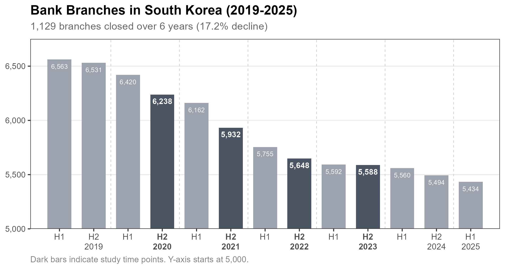
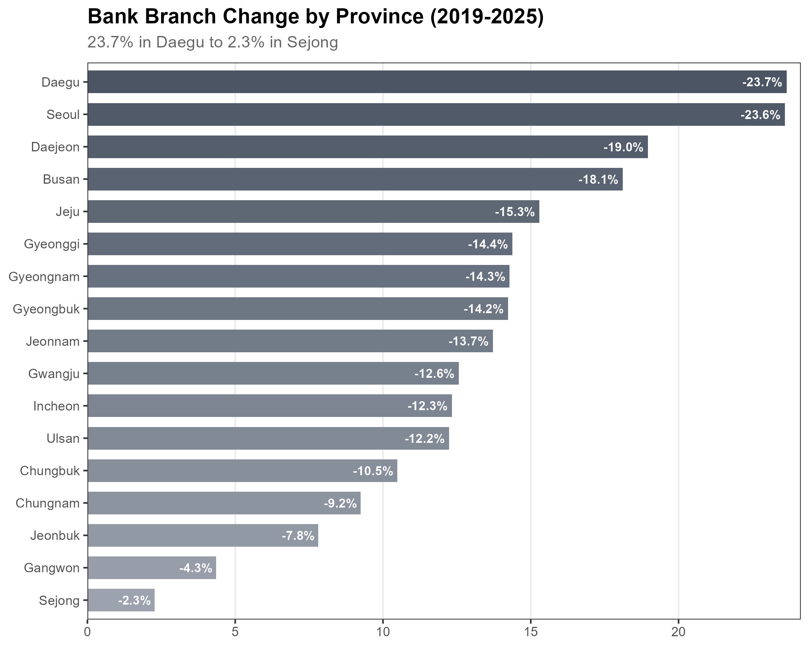
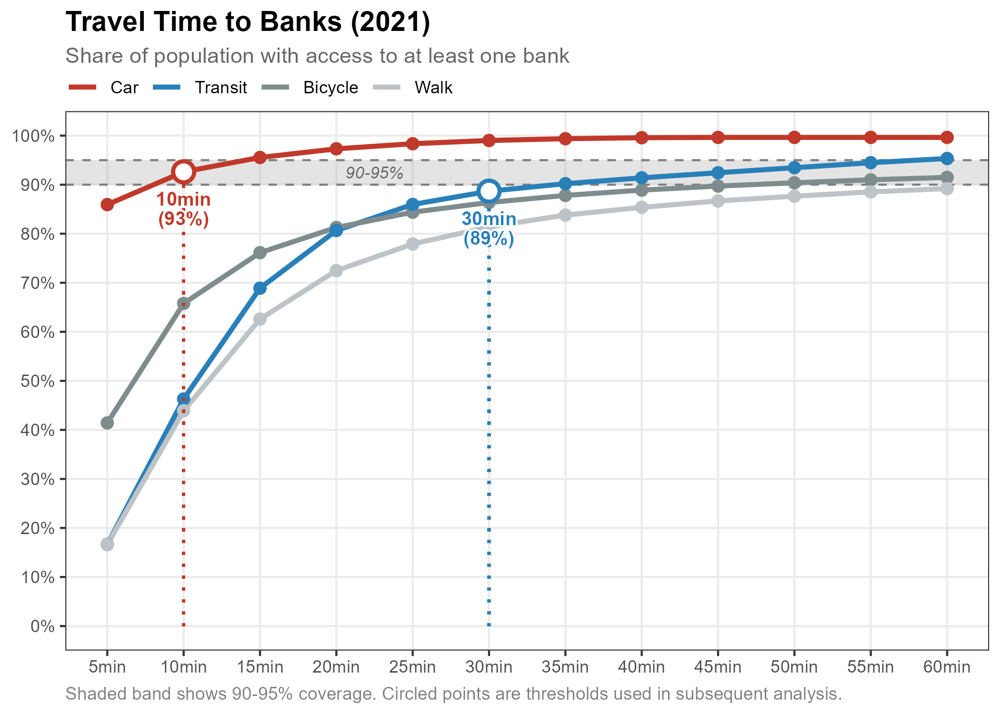
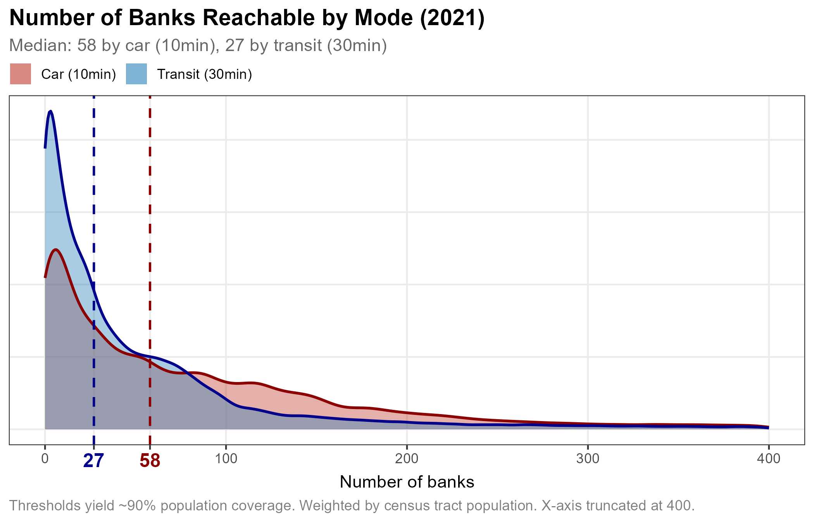
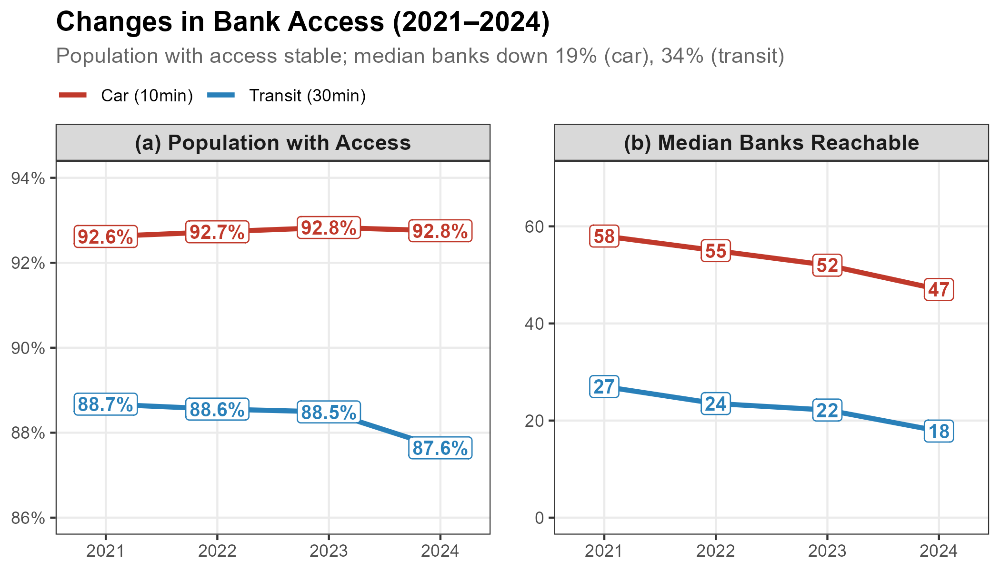
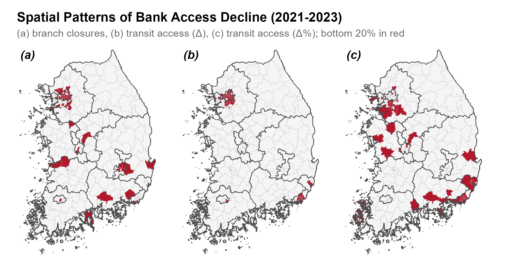
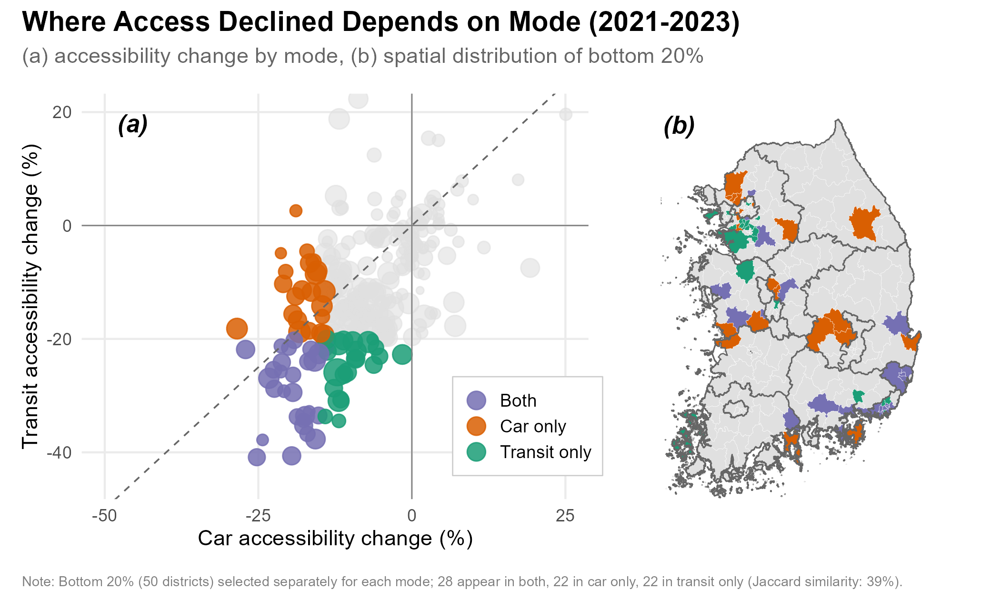
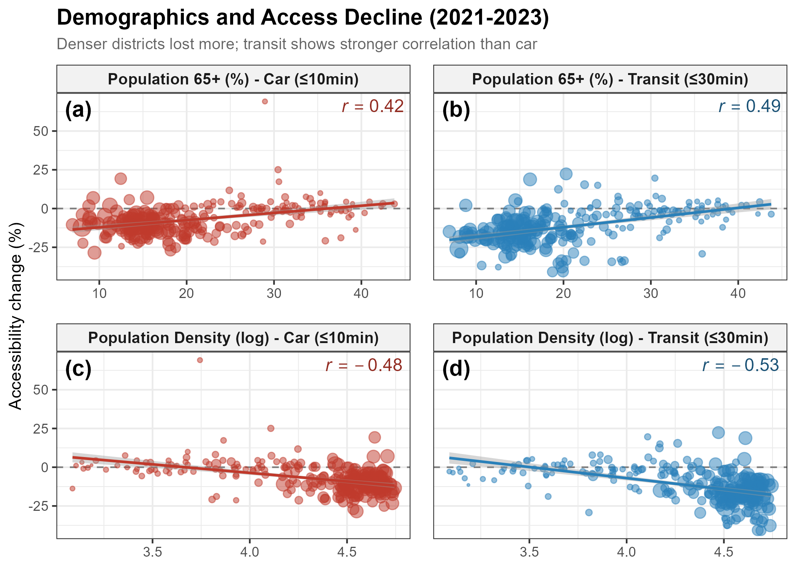

# Case Study: Banking Access {#sec-casestudy}

The previous chapters built a workflow: data preparation (@sec-data), routing functions (@sec-routing), and scaling strategies (@sec-scaling). This chapter applies that workflow to a real question: **how has access to banks changed** as branches close across South Korea?

We analyze **about 100,000 census tracts** over **four years** (2021–2024), comparing car and transit. The results illustrate what the workflow can produce, and the kinds of patterns that multi-year, multimodal analysis reveals.

## The Decline in Bank Branches

Bank branches in South Korea have been closing steadily, the trend that motivates this analysis. The country had 6,563 branches in early 2019; by early 2025, only 5,434 remained, a **17% decline** over six years. The dark bars in the figure mark the four year-end branch snapshots (2020–2023) we analyze below; each is paired with the following March's transit and road networks, which is why we label the analysis years 2021–2024.

::: {.callout-note collapse="true"}
## Did some regions lose more than others?

Metropolitan cities saw the steepest declines: Daegu and Seoul (both −24%), followed by Daejeon and Busan (−18% to −19%). More rural areas like Gangwon and the new administrative city Sejong saw much smaller declines (−2% to −4%), though they had fewer branches to begin with.

:::

## Baseline Conditions

Branches declined, but did that make banking harder to reach? To answer this, we 1) establish **comparable thresholds** across transport modes, then 2) measure how many banks people can reach within those limits. Using 2021 as our starting point, we examine each in turn.

### Can People Reach a Bank?

For each transport mode, we plot the share of population with bank access at each travel time. A point on the curve (say, transit at 10 minutes showing 46%) means 46% of the population lives within 10 minutes of at least one bank by transit.

By car, **86% of the population** can reach a bank within 5 minutes, and 93% within 10. By transit or on foot, only 17% can reach one in 5 minutes; transit then rises faster: 46% versus 44% at 10 minutes, 89% versus 81% at 30. By bicycle, early coverage is higher (41% at 5 minutes) and exceeds transit up to about 20 minutes, but both reach similar levels (86–89%) by 30 minutes.

We use **10 minutes for car** and **30 minutes for transit** as reference thresholds. Both yield roughly 90% population coverage (93% and 89%, at the edge of the shaded band), providing a common baseline for comparing the two modes. With coverage established, we next ask how many banks people can actually reach.

### How Many Can They Reach?

By car, half the population can reach **58 or more banks** within 10 minutes; by transit, **27 or more** within 30 minutes. The shapes of these distributions differ too: car access spreads across a wide range, while transit **concentrates near zero**: many areas cannot reach any bank even within 30 minutes. We use the medians, marked as dashed lines, to track changes over time in the next section.

## Changes Over Time

We computed the same metrics for four years, 2021 through 2024, to see how they changed as branches closed.

Population with access held steady: car at 92–93%, transit dipping slightly from 89% to 88%. But **median banks reachable fell each year**: from 58 to 47 for car (−19%), from 27 to 18 for transit (−33%). Most people still have *some* access because closures targeted redundant locations; but they have **fewer options** to choose from.

## Where Access Declined

The national trends above used medians, which smooth over regional anomalies. For district-level analysis, we restrict to 2021–2023: the 2024 GTFS for Busan showed abnormally short trip durations, and such errors distort spatial comparisons even if they wash out in national aggregates.

We compare three decline patterns at the district level: branch closures, change in banks reachable by transit within 30 minutes (absolute), and the same as a percentage. Each map highlights the bottom 20% of districts.

The three panels show different stories:

-   **Panel (a)**: Closures spread nationwide. Daegu stands out: many branches closed, but alternatives remained nearby.
-   **Panel (b)**: Absolute decline clusters in Seoul and Busan. Dense transit networks meant residents could reach many banks; losing some still left options, but the drop in raw numbers was large.
-   **Panel (c)**: Relative decline hits peripheral districts. With few banks reachable to begin with, even one or two closures translate to double-digit percentage drops.

The mismatch matters: most districts in (a) do not appear in (b) or (c). Bank closures **reduced choice** in cities; they **reduced access** in rural areas.

## Where Modes Differ

The maps above focused on transit. Do the same districts rank worst when measured by car?

We select the bottom 20% of districts by accessibility decline, separately for each mode, and compare where they overlap.

Only **28 districts** appear in both lists (Jaccard similarity: 39%). The rest split roughly evenly: 22 worst by car only, 22 worst by transit only.

-   **Panel (a)**: Each point is a district. The diagonal marks equal decline under both modes. Districts in the lower-left saw large drops in both; those far from the diagonal experienced mode-specific declines.
-   **Panel (b)**: Purple districts appear in both bottom 20% lists. Orange and teal mark car-only and transit-only declines, respectively.

The low overlap carries a practical point: **analyzing one mode would miss much of the problem**. Car-only studies overlook transit-dependent communities; transit-only studies miss car-reliant peripheries. The workflow makes such multimodal comparisons routine.

## Who Lost Access

Do declines correlate with demographics? We look at two variables: share of residents 65 and over, and population density.

Two patterns stand out:

-   **Elderly share** (panels a, b): Districts with more elderly saw *smaller* declines. This seems counterintuitive, but it reflects a floor effect: these areas had few banks to begin with.
-   **Population density** (panels c, d): Denser districts lost more. Urban branches consolidated; rural areas had little left to lose.

Transit correlations are stronger than car. People who depend on transit, often elderly and often in less dense areas, **started with worse access** and continue to fall behind.

These results measure how much access changed, where, and for whom. They stop short of a further question: how much of the change came from the closures themselves, and how much from the transit network changing underneath? Answering it requires counterfactual routing, which we develop in a companion paper and summarize in @sec-beyond.